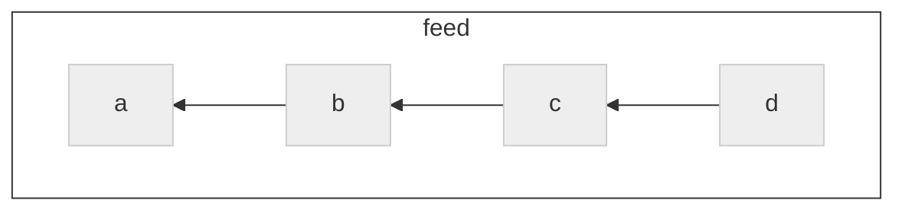
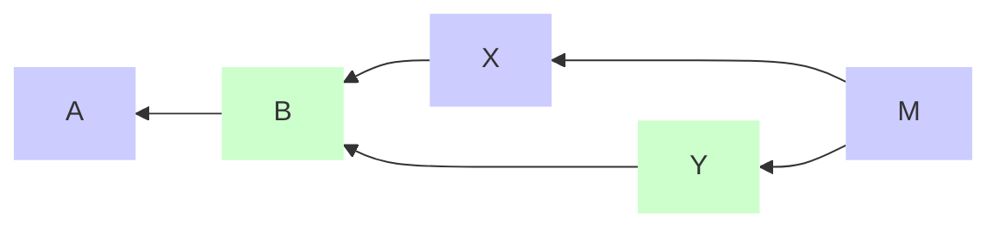

# Tangles

Authors: Mix Irving <mix@protozoa.nz>, Andre Staltz <contact@staltz.com>

Date: 2023-03-23

License: CC0-1.0


## Abstract

In any given set of SSB messages, it is impossible to determine their partial or
total order based on timestamps alone.  However, including the hashes of
previous messages in a message allows us to determine the order of messages.  In
this SIP, we specify a consistent way of declaring hashes of previous messages,
such that they form a directed acyclic graph (DAG).  This DAG is useful for many
use cases, including replication, and multi-writer "records".


## Motivation

As a permissionless, decentralized, and eventually consistent database, SSB
cannot rely on timestamps to determine the order of messages. Instead, when a
message refers to the hash of another message, we can infer that the message
that was referred to must have been created first, because we cannot create that
hash without knowing the original data. These referred hashes effectively form a
proof that a message was created after another message.

A "tangle" in SSB is a pattern of declaring previous message hashes, which will
define a directed acyclic graph (DAG) of messages.  A tangle is a useful way to
determine a partial ordering which in turn is useful for everything from
replication to building multi-writer "records".

A topological sort of a tangle renders a linear ordering of messages, which is
useful for displaying messages in user interfaces.


## Terminology

The key words "MUST", "MUST NOT", "REQUIRED", "SHALL", "SHALL NOT", "SHOULD",
"SHOULD NOT", "RECOMMENDED", "MAY", and "OPTIONAL" in this document are to be
interpreted as described in RFC 2119.


## Specification

There are different types of tangle, but they all MUST specify:

1. **Candidates messages**: the set of messages which _could_ be part of the
  tangle
2. **Recipe**: how the tangle (the DAG) is constructed from these candidates

It is RECOMMENDED for every recipe to start with some "root message" and extend
out from that point, checking the validity of messages as they are added.  Some
candidate messages may not have connections to the graph, or may be "invalid"
extentions, in which case they are excluded from the tangle.

A given message MAY belong to zero, one, or many tangles.  Each tangle
is a separate DAG.  A tangle is identified by a human-readable string.

TODO: glossary for "oldest" message (this will be the `root`)
TODO: glossary for "tip" messages


### Tangle fields in messages

Each message `m` in a tangle SHOULD have a `tangles` field in the `content`
field, i.e. `m.content.tangles`.  If `m.content.tangles` exists, its value MUST
be an object with one field for each tangle.  The key of the field MUST be the
tangle's human-readable identifier string (lets refer to it here as `x`), and
the value MUST be an object with the following fields:

- `root`: the ID of the root message of the tangle or `null` if `m` is the root
- `previous`: an Array of message IDs of the known tip(s) of the DAG at the time
  `m` was published, or `null` if `m` is the root


### Classic feed: single-author tangle

The most trivial tangle is the classic SSB feed.  In this case, the tangle for
feed `A` is defined as:

1. **Candidates messages**:
   - MUST have `author` field equal to `A`
2. **Recipe**:
   1. Find the message with `sequence` field equal to `1` as your "root"
       - Check it's signed correctly by `A`
   2. Find the message with `sequence` field equal to `i` for some `i` > `1`
       - Check it's signed correctly by `A`
       - Check its `previous` field points to a message with `sequence` field
         equal to `i-1`




The tangle data these messages carry looks like:
```javascript
a => { sequence: 1, previous: null, ... }
b => { sequence: 2, previous: a, ... }
c => { sequence: 3, previous: b, ... }
d => { sequence: 4, previous: c, ... }
```

(The fields `author`, `signature`, `timestamp`, `hash`, and `content` have been
ommited here to make the backlinking pattern clearer)

This is a special case of a tangle, for a few reasons:

- This tangle does not have `m.content.tangles[x]` with `root` and `previous`
- The DAG is a single chain, with no branches or merges


### Multi-author tangle

While the classic feed is a special case of a tangle without branches, in the
case of multiple authors, we need to support branches and merges. This is
because different authors may contribute concurrently, or while offline.


_Diagram where messages X, Y were both published concurrently (so were unaware
of one another). Message M is aware of both X and Y, and extends the tangle from
them.  M is now the new "tip" of the tangle._

The tangle data these messages carry looks like:

```javascript
A => { root: null, previous: null }
B => { root: A,    previous: [A] }
X => { root: A,    previous: [B] }
Y => { root: A,    previous: [B] }
M => { root: A,    previous: [X, Y] }
```

Where:
- `root` is the ID of the root message of the tangle
- `previous` is an Array of message IDs of the tip(s) of the tangle at the time
  this message was published

Note: the root message cannot include its own ID (not known until published),
so it sets its `root` value as `null`, which means "I am a root".


TODO: explain that this is a "tangle pattern" because there is no "candidates"
and "recipe" here and `m.content.tangles[x]` is not used.


## Considerations

TODO

## References

TODO

### Normative

TODO (List SIPs and RFCs that this document depends on)

### Informative

TODO (List any other links here)

### Implementation

TODO (Put a link to your reference implementation)
