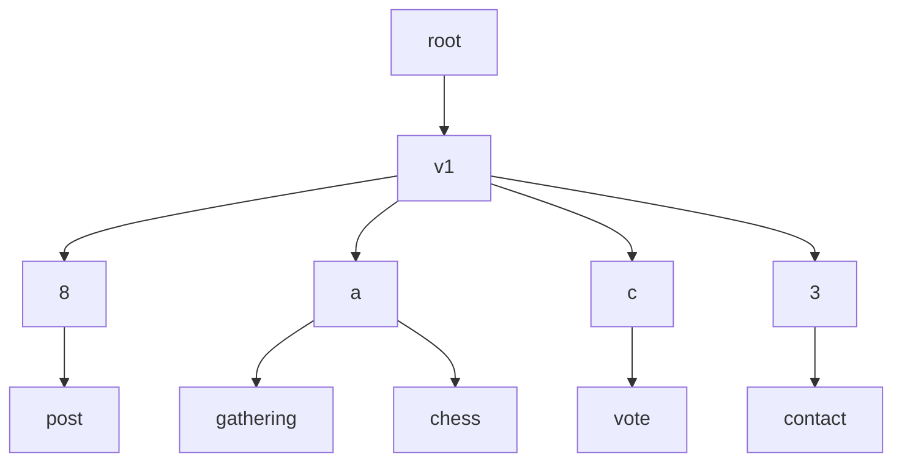

# Metafeeds

Author: Anders Rune Jensen

Date: 2021-10-11

License: CC0-1.0

## Abstract

In classical SSB an identity is tied to a single feed. All messages
for different kinds of applications are posted to this single
feed. While it is possible to create multiple feeds, there has been no
formal specification for how these feeds relate and what their
purposes are.

Metafeeds aim to solve these problems by tying an identity to a metafeed
instead. A metafeed references other feeds (or even metafeeds) and
contains metadata about the feed including purpose and feed
format. This allows for things like feed rotation to a new feed
format, splitting data into separate (sub)feeds and to create special
indexing feeds for partial replication.

A metafeed is tied to a single identity and thus should only be used
on a single device. There is a separate [fusion identity] protocol
that only deals with how to relate multiple devices to a single
identity. This spec here is not for that use-case.

Metafeeds will use a specialized feed format known as [bendy butt] that aims
to be very easy to implement. The aim is that this will make it easier for
implementations which do not need or want to support the classical SSB format.

## Terminology

The key words "MUST", "MUST NOT", "REQUIRED", "SHALL", "SHALL NOT", "SHOULD",
"SHOULD NOT", "RECOMMENDED", "MAY", and "OPTIONAL" in this document are to be
interpreted as described in RFC 2119.

We use bencode and [BFE] notations as defined in the [bendy butt] spec.

## Specification

### Usage of Bendy Butt feed format

Metafeeds **MUST** use the [bendy butt] feed format with a few additional
constraints.

The `content` dictionary inside the `contentSection` of meta feed messages
**MUST** conform to the following rules:

 - Has a `type` field mapping to a BFE string (i.e. `<06 00> + data`) which
 can assume only one the following possible values:
   - `metafeed/add/existing`
   - `metafeed/add/derived`
   - `metafeed/update`
   - `metafeed/tombstone`
 - Has a `subfeed` field mapping to a BFE "feed ID", i.e. `<00> + format + data`
 - Has a `metafeed` field mapping to a BFE "Bendy Butt feed ID", i.e.
 `<00 03> + data`
 - (Only if the `type` is `metafeed/add/derived`): a `nonce` field mapping
to a BFE "arbitrary bytes" with size 32, i.e. `<06 03> + nonce32bytes`

The `contentSignature` field inside a decrypted `contentSection` **MUST** use
the `subfeed`'s cryptographic keypair.

### Example of a metafeed

Here is an an example of a metafeed with 2 subfeeds: one for `main`
social data and another one for `application-x` in a different format.


<details>
digraph metafeed {

  rankdir=RL
  node [shape=record];

  edge [tailclip=false];
  a [label="{ <ref> | <data> main }"]
  b [label="{ <ref> | <data> application-x }"];
  b:ref:a -> a:data [arrowhead=vee, arrowtail=dot, dir=both];
}
</details>

Contents of messages in the metafeed that acts as metadata for feeds:

```
{
  "type" => "metafeed/add/existing",
  "feedpurpose" => "main",
  "subfeed" => (BFE-encoded feed ID for the 'main' feed),
  "metafeed" => (BFE-encoded Bendy Butt feed ID for the metafeed),
  "tangles" => {
    "metafeed" => {
      "root" => null,
      "previous" => null
    }
  },
},
{
  "type" => "metafeed/add/existing",
  "feedpurpose" => "application-x",
  "subfeed" => (BFE-encoded Bamboo feed ID),
  "metafeed" => (BFE-encoded Bendy Butt feed ID for the metafeed),
}
```

Initially the metafeed spec supports three operations: `add/existing`
`add/derived`, and `tombstone`. **Note**, signatures (see key
management section) are left out in the examples here.

Tombstoning means that the feed is no longer part of the metafeed.
Whether or not the subfeed itself is tombstoned is a separate
concern.

Example tombstone message:

```
{
  "type" => "metafeed/tombstone",
  "subfeed" => (BFE-encoded Bamboo feed ID),
  "metafeed" => (BFE-encoded Bendy Butt feed ID for the metafeed),
  "reason" => (some BFE string),
  "tangles" => {
    "metafeed" => {
      "root" => (BFE-encoded message ID of the "metafeed/add" message),
      "previous" => (BFE-encoded message ID of the "metafeed/add" message),
    }
  }
}
```

Updating the metadata on a subfeed which is a member of a metafeed
is currently not supported.

**Note**: while the `metafeed: ...` field on the add and tombstone messages
seems redundant, it is important to have it and check that the `metafeed` field
equals the author of the metafeed itself to protect against replay attacks.

### Applications example

An example of the applications metafeed with two different
applications.


<details>
digraph Applications {

  rankdir=RL
  nodesep=0.6
  node [shape=record];

  edge [tailclip=false];
  a [label="{ <ref> | <data> App1 }"]
  b [label="{ <ref> | <data> App2 }"];

  b:ref:a -> a:data [arrowhead=vee, arrowtail=dot, dir=both];
}
</details>

```
{
  "type" => "metafeed/add/derived",
  "feedpurpose" => "gathering",
  "subfeed" => (BFE-encoded feed ID dedicated for the gathering app),
  (other fields...)
},
{
  "type" => "metafeed/add/derived",
  "feedpurpose" => "chess"
  "subfeed" => (BFE-encoded feed ID dedicated for the chess app),
  (other fields...)
}
```

### Tree structure

Since a subfeed can be a metafeed itself, this means that the relationships
between subfeeds and metafeeds is a tree. We refer to the top-most metafeed as
the "root" metafeed.

While a metafeed **MAY** contain any arbitrary subfeed, we prescribe a
**RECOMMENDED** structure for the tree.

Under the root metafeed, there **SHOULD** be only one *type* of subfeed:
*versioning subfeeds*. For now, there **SHOULD** be only subfeed `v1`, but in
the future, this spec will be extended to describe subfeed `v2` once it is time
to deprecate `v1`.

The subfeeds at the leafs of the tree contain actual content. Once there is a
new versioning subfeed, the leaf feeds can be transferred under the new
versioning subfeed via `metafeed/add/existing` messages, without having to
recreate the leaf feeds. Thus, the tree structure is only concerned with the
*organization* of feeds in order to assist partial replication. For example,
by grouping together feeds that are part of the same application under a common
metafeed, we can skip replication of those application feeds if they are not
relevant to the user.

#### v1

This section describes the specification of the organization of subfeeds under
the `v1` versioning subfeed.

To start with, the `v1` versioning subfeed **MUST** be created with the
following `content` on the root metafeed:

```
{
  "type" => "metafeed/add/derived",
  "feedpurpose" => "v1",
  "subfeed" => (BFE-encoded feed ID dedicated for the versioning subfeed),
}
```

The feed format for `v1` **MUST** be [bendy butt], because it is a metafeed.

The *direct* subfeeds of `v1` are the so-called *shard feeds*. The actual
application-specific subfeeds are under the shard feeds. Sharding is based on
4 bits of entropy extracted from the application-specific subfeed, and
can be represented by 1 hexadecimal digit. We will call that digit the "nibble".
The nibbles are: `0`, `1`, `2`, `3`, `4`, `5`, `6`, `7`, `8`, `9`, `a`, `b`,
`c`, `d`, `e`, `f`. The number of shards is specifically set at 16 to allow for
efficient partial replication in realistic scenarios. See
[sharding math](./sharding-math.md) for mathematical details on the choice of
number of shards.

The purpose of the shard feeds is to allocate the set of application-specific
subfeeds into 16 separate groupings of feeds, i.e. one for each nibble. This
way, if you are only interested in replicating a subset of the
application-specific subfeeds, you can deterministically calculate the nibble
for those application-specific subfeeds, and then you know which shard feeds
to replicate.

When adding a new application-specific subfeed to the tree, we need to determine
the parent shard based on a "name", which is any UTF-8 string that the
application can choose freely, but it is **RECOMMENDED** that this string be
unique to the use case. Then, the shard feed's nibble is calculated as the first
hexadecimal digit of the following SHA256 hash:

```
sha256_hash(concat_bytes(root_metafeed_id, name))
```

where `root_metafeed_id` is the BFE-encoded ID of the root metafeed, and
`name` is a BFE-encoded UTF-8 string.

The nibble is then used to create a new shard feed, unless there is already
one. There **MUST** be at most *one* shard feed for every unique nibble. The
`content` on the root's message for the shard feed **MUST** have the nibble
encoded as hexadecimal in the `feedpurpose` field of the `metafeed/add/derived`
message. The feed format for a shard feed **MUST** be [bendy butt], because
they are metafeeds.

Once the shard feed is created, the application-specific subfeeds can be added
as subfeeds of that one, either as `metafeed/add/derived` or
`metafeed/add/existing`.

The following diagram is an example of the organization of subfeeds under the v1
specification:



It is **RECOMMENDED** that the application-specific subfeeds are leafs in the
tree, but they **MAY** be metafeeds that contain other application-specific
subfeeds.

### Key management, identity and metadata

As mentioned earlier, in classical SSB the feed identity is the same
as the feed. Here instead we want to decouple identity and feeds.

#### Existing SSB identity

To generate a metafeed and link it to an existing `main` feed, first
a seed is generated:

```js
const seed = crypto.randomBytes(32)
```

From this seed, a metafeed can be generated using:

```js
const salt = 'ssb'
const prk = hkdf.extract(lhash, hash_len, seed, salt)
const mf_info = "ssb-meta-feed-seed-v1:metafeed"
const mf_seed = hkdf.expand(hash, hash_len, prk, length, mf_info)
const mf_key = ssbKeys.generate("ed25519", mf_seed)
```

Note we use `metafeed` here in the info. As the top/genesis metafeed is
special we use that string, for all other derived feeds a nonce is used,
which is also published in the corresponding `metafeed/add/derived`
message.

We also encrypt the seed as a private message from `main` to `main` (so
it's a private message to yourself; notice this is JSON, because it's
published on the main):

```
{
  "type": "metafeed/seed",
  "metafeed": ssb:feed/bendybutt-v1/bendyButtFeedID,
  "seed": seedBytesEncodedAsHexString
}
```

By doing so we allow the existing feed to reconstruct the metafeed and
all subfeeds from this seed.

Then the metafeed is linked with the existing `main` feed using a new
message on the metafeed signed by both the `main` feed and the meta
feed. For details this see [bendy butt].

```
{
  "type" => "metafeed/add/existing",
  "feedpurpose" => "main",
  "subfeed" => (BFE-encoded feed ID for the 'main' feed),
  "metafeed" => (BFE-encoded Bendy Butt feed ID for the metafeed),
  "tangles" => {
    "metafeed" => {
      "root" => (BFE nil),
      "previous" => (BFE nil)
    }
  }
}
```

In order for existing applications to know that the existing feed
supports metafeeds, a special message of type `metafeed/announce`
is created on the `main` feed (notice this is JSON, because the
 main feed is not in Bendy Butt):

```js
{
  // ... other msg.value field ...
  content: {
    type: 'metafeed/announce',
    metafeed: 'ssb:feed/bendybutt-v1/-oaWWDs8g73EZFUMfW37R_ULtFEjwKN_DczvdYihjbU=',
    subfeed: MAIN_FEED_ID,
    tangles: {
      metafeed: {
        root: null,
        previous: null
      }
    },
    signature: SIGNATURE_OF_THE_ABOVE
  }
}
```

Note that MAIN_FEED_ID is the ID of the main feed, and that
SIGNATURE_OF_THE_ABOVE is the signature (using the metafeed
keys) of the stringified `content` *without* `content.signature`
itself, in a similar manner to how the message signature
`msg.value.signature` is constructed relative to `msg.value`. So
`msg.value.signature` is signed with the `main` feed's keys, but
`msg.value.content.signature` is signed with the *metafeed keys*.

A feed can only have **one** metafeed. If for whatever reason an
existing metafeed needs to be superseed, a new message is created
pointing to the previous `metafeed/announce` message via the tangle.

#### New SSB identity

A new identity also starts by constructing a seed. From this seed both
the metafeed keys and the main feed keys are generated. The main
should use the info: `ssb-meta-feed-seed-v1:<base64 encoded nonce>`
and the `nonce` is also published as part of the `metafeed/add/derived`
message on the metafeed.

```
{
  "type" => "metafeed/add/derived",
  "feedpurpose" => "main",
  "subfeed" => (BFE-encoded feed ID for the 'main' feed),
  "metafeed" => (BFE-encoded Bendy Butt feed ID for the metafeed),
  "nonce" => (bencode byte sequence with 32 random bytes),
  "tangles" => {
    "metafeed" => {
      "root" => null,
      "previous" => null
    }
  }
}
```

The seed will also be encrypted to the main feed and the metafeed
linked to the main feed just like for existing feeds.

#### Identity backwards compatibility

By building a layer on top of existing feeds we maintain backwards
compatible with existing clients. The identity to be used by new
applications should be that of the metafeed. For backwards
compatibility contact messages forming the follow graph together with
secret handshake will continue to use the key of the main feed.

It is worth noting that even though the examples above specify ways to
generate new feeds from a single seed, it is perfectly fine and in
some cases a better idea to generate a feed not from this seed. Thus
in the case the main key being broken or stolen, you don't loose
everything.

If a key is reused in another part of the tree it must include a
reference to the original subfeed or metafeed it was defined in. The
original place is the authorative place for its metadata.

Using [BIP32-Ed25519] instead was considered but that method has a
weaker security model in the case of a key compromised where keys are
shared between devices.

### Use cases

Let us see how we can use the above abstraction to solve several
common examples:

#### New feed format

Changing to a new feed format could be implemented by adding a new
feed to the metafeed state, and by adding a tombstone message to the
old feed pointing and assigning the new feed as active in the meta
feed.

In case of backwards compability with clients that do not support a
newer feed format or in the case of only wanting to support newer feed
formats, maintaining muliple feeds with the same content would be an
interesting avenue to explore. As the hash of the messages in the two
feeds would be different, there could be a way to include the hash of
the corresponding message in old feed in the newer feed.

Lower end clients could offload this extra storage requirement to
larger peers in the network.

#### Claims or indexes

For classical SSB feeds if one would like to replicate a specific part
of a feed, such as the contact messages, one could request another
peer to generate a feed that only references these messages. Then when
exchanging data, the original messages could be included as auxiliary
data. This would only act as a claim, never as a proof that some
messages were not left out. Naturally this comes down to trust
then. Using the friend graph would be natural, as would using trustnet
together with audits of these claims.

#### Subfeeds

Similar to claims it would be possible to create subfeeds that would
only contain certain messages. This might be useful for specific
apps. Another use case for this would be curated content, where
specific messages are picked out that might be of particular interest
to a certain application or specific people, or say messages within
the last year.

#### Ephemeral feeds

Using the metadata it would be possible to attach a lifetime to feeds,
meaning honest peers would delete the feeds after a specific
time. This would enable applications to generate a short lived feed
only for the communication between two parties.

#### Allow list

Similar to ephemeral feeds it would be possible to attach an allow
list to a feed and only distribute this feed to people on the allow
list. As with ephemeral feeds, this cannot be enforced, but assuming
honest peers would give piece of mind that the data is only stored on
a certain subset of the whole network. This can naturally be combined
with private groups to better ensure safety.

### Open questions

- In the case of claims, how are bad actors handled?
- What are the broader consequences of ephemeral feeds. Maybe they can
only be used in limited circumstances, and if so which ones?
- For subfeeds and feed rotation what is the best way to handle
  potentially overlapping messages

## References

### Normative

- [SIP 4](./004.md) "Bendy Butt"

### Informative

- [BIP32-Ed25519]

### Implementation

- [ssbc/ssb-meta-feeds](https://github.com/ssbc/ssb-meta-feeds) in JavaScript

### Acknowledgments and prior work

CFT suggested the use of metafeeds
in [ssb-observables issue 1](https://github.com/arj03/ssb-observables/issues/1).

[BIP32-Ed25519]: https://github.com/wallet-io/bip32-ed25519/blob/master/doc/Ed25519_BIP.pdf
[ssb-secure-partial-replication]: https://github.com/ssb-ngi-pointer/ssb-secure-partial-replication
[fusion identity]: https://github.com/ssb-ngi-pointer/fusion-identity-spec/
[bencode]: https://en.wikipedia.org/wiki/Bencode
[BFE]: https://github.com/ssbc/ssb-bfe-spec
[bendy butt]: https://github.com/ssb-ngi-pointer/bendy-butt-spec
