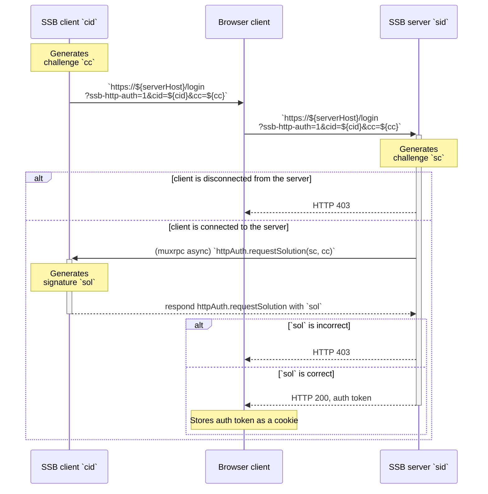
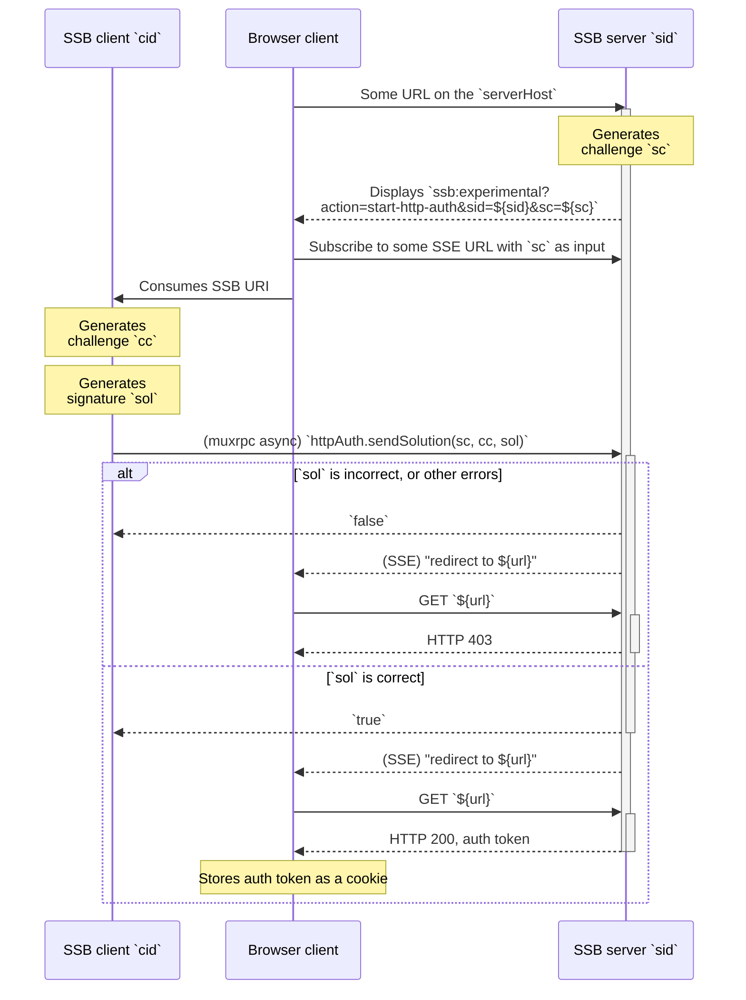
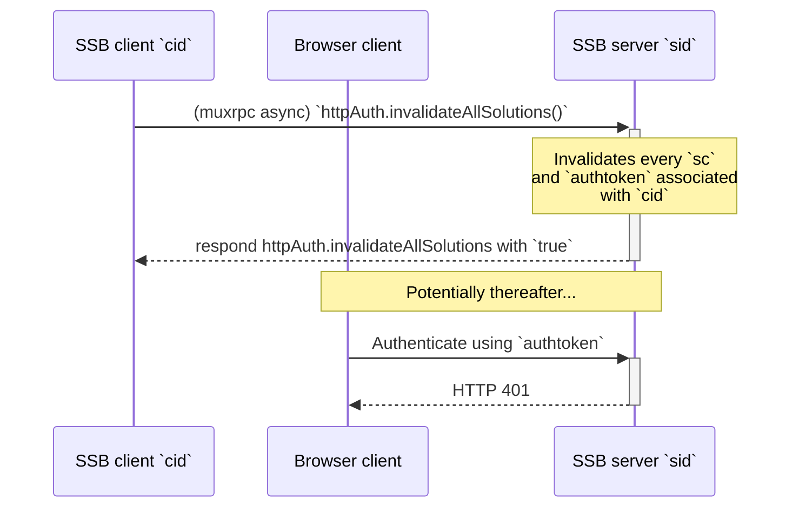
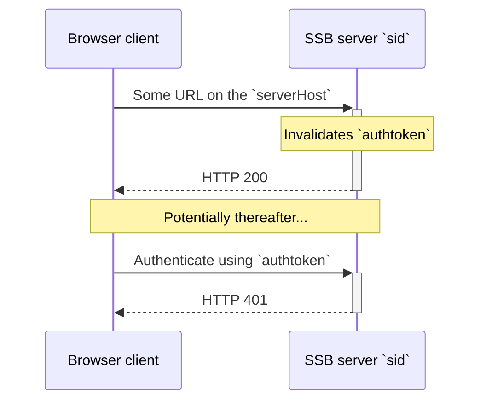

# HTTP Authentication

Author: Andre 'Staltz' Medeiros <contact@staltz.com>

Date: 2021-04-26

License: CC0-1.0

## Abstract

SSB is a peer-to-peer system where there should not be a client-server distinction, but there are exceptions to this nature. "Pub servers" and "room servers" are nodes with privileged internet-wide presence that can provide replication and tunneled-connection services to several peers. Since these servers often also host a public HTTP interface, concern has been raised on how authenticated clients are to interact with these services over HTTP when requesting access-restricted resources. SSB HTTP Authentication is a protocol that utilizes both SSB muxrpc and HTTPS to grant an HTTP client (such as a browser) access to resources authorized for the SSB client peer.

## Terminology

The key words "MUST", "MUST NOT", "REQUIRED", "SHALL", "SHALL NOT", "SHOULD", "SHOULD NOT", "RECOMMENDED", "MAY", and "OPTIONAL" in this document are to be interpreted as described in [RFC 2119](https://tools.ietf.org/html/rfc2119).

## Conditions

This specification makes clear assumptions about the setup involved peers authenticating.

**Server:** an SSB peer, known as the "server", **MUST** have an internet-public host address, **MUST** be accessible for secret-handshake connections under a multiserver address, and **MUST** support HTTPS requests as well as it **MUST NOT** support plain HTTP.

**Client:** another SSB peer, known as the "client", **MUST** be able to open a secret-handshake and muxrpc connection with the server. The user controlling this SSB peer also **SHOULD** control a web browser used to make requests to the server. The client's browser and operating system **SHOULD** support hyperlinks to [SSB URIs](https://github.com/ssb-ngi-pointer/ssb-uri-spec), redirecting them to SSB applications that recognize and parse SSB URIs. The client's SSB application employed during SSB HTTP Authentication **MUST** be able to recognize and parse SSB URIs.

**Connections:** the server and the client **SHOULD** recognize each other's SSB IDs as mutually trusted (such as a mutual follow relationship, or "membership" relationship where the client has claimed an invite token from the server). For the authentication protocol described in this document to succeed, the two SSB peers **MUST** be connected to each other via muxrpc and secret-handshake for the entire duration of the protocol. The purpose of SSB HTTP Authentication is to extend the trust that exists between these peers from the muxrpc context to the context of HTTP in the browser.

## Specification

A client known by its SSB ID `cid` is connected via secret-handshake and muxrpc to a server known by its SSB ID `sid`. The server is hosted at `serverHost`. A browser controlled by the same person or agent as the `cid` peer wishes to request an access-restricted resource (such as an admin dashboard) at the server over HTTP. All HTTP requests **MUST** be done with HTTPS.

The three sides (browser client, SSB client `cid`, and SSB server `sid`) perform a [challenge-response authentication](https://en.wikipedia.org/wiki/Challenge%E2%80%93response_authentication) protocol, specified as UML sequence diagrams. We use the shorthands `sc`, `cc`, and `sol` to mean:

- `sc`: "server's challenge"
- `cc`: "client's challenge"
- `sol`: "solution"

The challenges, `cc` and `sc`, are 256-bit [cryptographic nonces](https://en.wikipedia.org/wiki/Cryptographic_nonce) encoded in base64. The solution `sol` is a cryptographic signature using the cryptographic keypair `cid` that identifies the client, described below:

- `sid` is the servers's identity from their cryptographic keypair
- `cid` is the client's identity from their cryptographic keypair
- `sc` is a 256-bit nonce created by the server, encoded in base64
- `cc` is a 256-bit nonce created by the client, encoded in base64
- `sol` is the client's cryptographic signature of the string `=http-auth-sign-in:${sid}:${cid}:${sc}:${cc}` where `${x}` means string interpolation of the value `x`

Both sides generate the nonces, but there are use cases where one side should start first. In other words, the challenge-response protocol described here can be either **client-initiated** or **server-initiated**.

The HTTPS endpoint `/login` with the query parameter `ssb-http-auth` **MUST** be employed as specified here, but URLs for logging out and for Server-Sent Events (SSE) are left unspecified and implementations are free to choose their routes. The muxrpc APIs `httpAuth.requestSolution(sc, cc)`, `httpAuth.sendSolution(sc, cc, cr)`, `httpAuth.invalidateAllSolutions()` and the SSB URI `ssb:experimental?action=start-http-auth&sid=${sid}&sc=${sc}` **MUST** be employed as specified here.

### Client-initiated protocol

In the client-initiated variant of the challenge-response protocol, the first step is the client creating `cc` and opening a web page in the browser. Then, the server attending to that HTTP request will call `httpAuth.requestSolution(sc, cc)` on the client SSB peer.

The UML sequence diagram for the whole client-initial protocol is shown below:




### Server-initiated protocol

In the server-initiated variant of the challenge-response protocol, the first step is the browser requesting a login from the server without any input data. The server answers the browser, which in turn displays an SSB URI which the SSB peer knows how to open.

The primary difference between this variant and the previous one is that the muxrpc async RPC call direction is reversed. Previously, the server called `httpAuth.requestSolution` **on the client**. In this variant, the client calls `httpAuth.sendSolution` **on the server**. The response is also different. In the previous case, the client's response is expected to be the `sol`. In this variant, the `sol` argument is provided by the client and the server's response is expected to be `true`.

The secondary difference with this variant is the addition of [Server-Sent Events](https://html.spec.whatwg.org/multipage/server-sent-events.html) (SSE) between the browser and the server, to update the browser when the muxrpc protocol succeeds.

The UML sequence diagram for the whole server-initial protocol is shown below:



The SSB URI **MAY** also contain the query parameter `multiserverAddress` with value `msaddr` matching the server's multiserver address, in case the client does not know how to map the server's `sid` to a multiserver address in order to call the muxrpc `http.sendSolution`:

```
ssb:experimental?action=start-http-auth&sid=${sid}&sc=${sc}&multiserverAddress=${msaddr}
```

### Sign-out

As a RECOMMENDED muxrpc API, `httpAuth.invalidateAllSolutions` on the server allows the SSB peer to invalidate *all* auth tokens associated with the `cid`. See UML sequence diagram:



The browser client also has the option of signing out with HTTP endpoints. This does not require a muxrpc call with the SSB peer. See UML sequence diagram:



## Security considerations

### Client consent

Because the sign-in process is seemless and happens in the background via muxrpc, without any input from the user who controls the client SSB peer, there is potential for vulnerabilities if the SSB URI is manipulated or the URL is manipulated.

SSB applications that control the client SSB peer therefore MUST prompt user consent before `httpAuth.requestSolution` or `httpAuth.sendSolution` are sent. The prompt SHOULD display the server's SSB ID and ask the user to confirm their intent to sign-in.

## References

### Normative

- [SIP 1](./001.md) "SSB URIs"
- [Server-Sent Events](https://html.spec.whatwg.org/multipage/server-sent-events.html)

### Informative

- [Wikipedia: challenge-response authentication](https://en.wikipedia.org/wiki/Challenge%E2%80%93response_authentication)
- [Wikipedia: cryptographic nonces](https://en.wikipedia.org/wiki/Cryptographic_nonce)

### Implementation

- [ssbc/go-ssb-room](https://github.com/ssbc/go-ssb-room/) server in Go
- [ssbc/ssb-http-auth-client](https://github.com/ssbc/ssb-http-auth-client)
client library in JavaScript


## Appendix A. List of required HTTP endpoints

- `/login`

## Appendix B. List of new muxrpc APIs

- async
  - `httpAuth.requestSolution(sc, cc)`
  - `httpAuth.sendSolution(sc, cc, cr)`
  - `httpAuth.invalidateAllSolutions()`

## Appendix C. List of new SSB URIs

- `ssb:experimental?action=start-http-auth&sid=${sid}&sc=${sc}`
