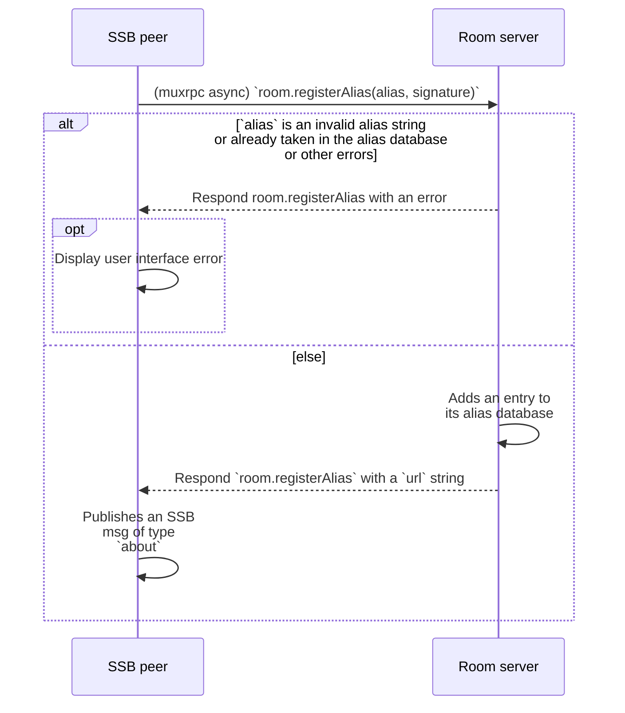
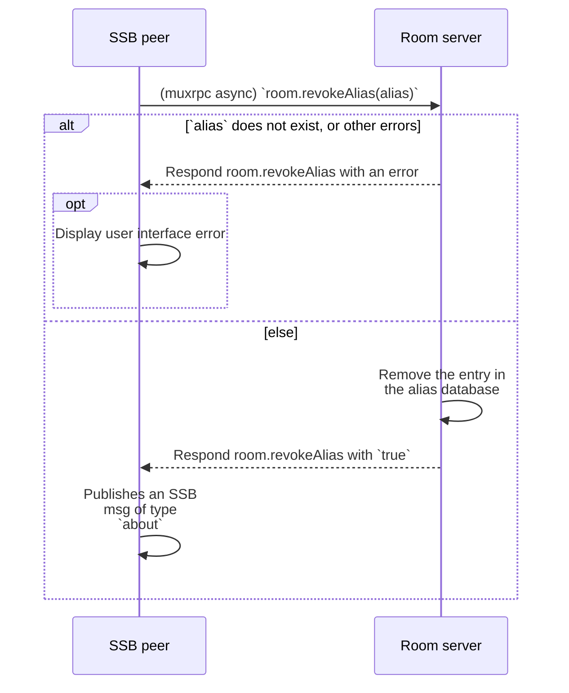

# Rooms 2

Author: Andre 'Staltz' Medeiros <contact@staltz.com>

Date: 2022-10-10

License: CC0-1.0

## Abstract

A room server is an SSB peer with privileged internet presence (for instance, not behind a NAT layer) which allows its clients to perform tunneled connections wich each other. For practical purposes, room clients seem to be connected to each other directly, but the room is an intermediary. Connections between server and client are end-to-end encrypted via secret-handshake, as well as in tunneled connections between room clients, so that the room server cannot eavesdrop on the payloads in the tunneled connections. This document describes new capabilities for rooms, such as user aliases, privacy modes, and tunneled authentication.

## Terminology

The key words "MUST", "MUST NOT", "REQUIRED", "SHALL", "SHALL NOT", "SHOULD", "SHOULD NOT", "RECOMMENDED", "MAY", and "OPTIONAL" in this document are to be interpreted as described in [RFC 2119](https://tools.ietf.org/html/rfc2119).

## Stakeholders

Persons or organizations that are involved or engaged in or around room servers. They may hold responsibilities or powers, and may cause harm to other stakeholders when their responsibilities or powers are abused. They hold interest in engaging with other stakeholders while managing the risk for harm associated with engagement. Harm mitigation such as [Privacy modes](#privacy-modes) is important when discussing stakeholders.

### Room admin

Person or organization responsible for operating the room server, and has full access rights over the server's resources such as logs, disk, memory, etc. In other words, this person or organization physically owns the room server or has SSH access to the remote server hosted in some PaaS cloud provider.

Typically, the admin possesses an SSB ID (it's very common, but not necessarily always the case), and is also a [moderator](#moderator) in the room.

### Internal user

SSB user who accesses the room server and is considered *internal* because they have already [joined](#joining) the room and may even have registered an [alias](#alias) in the room.

**Definition:** an *internal user* of a room is any SSB ID for which the room grants a [tunnel address](#tunnel-addresses). In other words, if an SSB ID is *reachable* via a [tunneled connection](#tunneled-connection) through a room server, then they are considered an internal user of that room.

**Becoming an internal user:** read more about that in [Joining a room](#joining).

### External user

Any SSB user who is not an [internal user](#internal-user) of the room (i.e. do not have a usable [tunnel address](#tunnel-addresses) referencing the room), but may still interact with the room server in meaningful ways, for instance with [tunneled connections](#tunneled-connection), [alias endpoints](#web-endpoint) or [alias consumption](#alias-consumption).

### Moderator

A moderator is an [internal user](#internal-user) that has acquired special privileges in the [web dashboard](#web-dashboard) and actions allowed by the dashboard.

Moderators can use sign-in to access the [dashboard](#web-dashboard).

## Setup

There are different ways a room server can be configured.

### Components

A room server is defined by several components, which are systems that enable features, some of these are optional and some are required.

#### REQUIRED

- [Tunneled connection](#tunneled-connection)
- [Tunnel addresses](#tunnel-addresses)
- [Privacy modes](#privacy-modes) (at least the *Open* mode)
- [Joining](#joining) (for at least the *Open* mode)

#### OPTIONAL

- Other [Privacy modes](#privacy-modes) and respective ways of [joining](#joining)
- [Internal user authentication](#internal-user-authentication)
- [Tunneled authentication](#tunneled-authentication)
- [Invites](#invites)
- [Web Dashboard](#web-dashboard)
- [Aliases](#alias)

### Privacy modes

A room server should allow the [room admin](#room-admin) or a [moderator](#moderator) to configure which users can become [internal user](#internal-user).

There are three strategies RECOMMENDED as policies to [join](#joining) the room, known as privacy modes:

- **Open**: invite codes are openly known, similar to [ssb-room v1](https://github.com/staltz/ssb-room)
- **Community**: only [internal users](#internal-user) can invite [external users](#external-user) to become an internal users
- **Restricted**: only [admins](#room-admin) and [moderators](#moderator) can invite [external users](#external-user) to become an internal users, and [aliases](#alias) are not supported

**Joining:** To become a member of the room, peers need to [join the room](#joining).

### Config database

The configuration database holds basic administrative data, readable only by [admins](#room-admin) and (indirectly via the [dashboard](#web-dashboard)) by [moderators](#moderator).

The database SHOULD contain these data points:

- Which [privacy mode](#privacy-modes) is selected
- List of SSB IDs of [moderators](#moderator)
- List of blocked SSB IDs
- Name of the room (a short string)
- Description for the room (not too long string)

### Web Dashboard

There SHOULD be a WWW interface that allows [moderators](#moderator) to sign-in and perform some privileged actions. The sign-in method **SHOULD** be SIP 6 (HTTP Authentication) but it **MAY** be username/password or other methods. [Internal users](#internal-user) can also sign-in and perform basic actions such as [create invites for other users to join](#joining).

The dashboard grants [moderators](#moderator) with features and powers such as:

- Block SSB IDs from connecting with this room, meaning two things:
  - If they were an [internal user](#internal-user), they get demoted to [external user](#external-user)
  - Even if they were an [external user](#external-user), the room server will reject new attempts of secret-handshake connections
- Unblock SSB IDs that are blocked
- Nominate other internal users to become moderators too
- View the list of aliases according to the [Alias database](#alias-database)
- Revoke aliases by removing an entry from the [Alias database](#alias-database)
- Change the [privacy mode](#privacy-modes) of the room
- View other technical measurements such as bandwidth used, storage used by the databases, etc

The dashboard grants [internal users](#internal-user) basic features such as:

- Register an alias for themselves
- Revoke an alias for themselves
- Create an invite for [external users](#external-user) to [join the room](#joining) if the room is running in [Community mode](#privacy-modes)

#### Security considerations

##### HTTPS vulnerabilities

Typically SSB has not relied on the certificate architecture underlying TLS, and has had no interoperability with HTTPS. Since rooms 2.0 rely on HTTPS, then the vulnerabilities inherent in TLS, such weak certificate authorities that can enable man-in-the-middle attacks. In such scenarios, with room servers there would be possibility for man-in-the-middle attacks when claiming invites (redirecting to another multiserver address), when [resolving aliases](#alias-consumption) (impersonating the alias owner), or when performing sign-in with SSB identities.

To mitigate these types of attacks, implementations and deployments of rooms should make a conscious choice of a trustworthy certificate authority.

##### Malicious [moderator](#moderator)

Moderators obviously hold some power, and this power may be abused through unfair blocks, unfair revoking of aliases. In many cases, fairness is subjective, and is understood to be an essential compromise of having moderation to begin with. So in this section we will focus our attention on unusual security issues with moderation.

A moderator has the right to nominate other internal users to become moderators, and this could lead to a proliferation of moderators, which increases the possibility that one of these moderators abuses their powers. On the other hand, there has been many maintainers and npm owners in the [SSBC](https://github.com/ssbc/) (e.g. 32 GitHub org members and 17 npm owners for the cornerstone [`ssb-db`](https://www.npmjs.com/package/ssb-db) package), we also know that the presence of many moderators may also help to *decrease* the possibility of abuse, because asymmetry of privilege is reduced.

## Participation

Before peers can connect to each other via a room server, they first need to become members, i.e. [internal users](#internal-user). This section describes the different protocols used for establishing internal user participation.

### Joining

"Joining a room" means the process where an [external user](#external-user) becomes an [internal user](#internal-user).

The joining process is different for each [Privacy mode](#privacy-modes):

- **Open:**
  1. An [external user](#external-user), Alice, acquires the open *invite code* either through the room's public website or via other means
  1. Alice consumes the invite code in her SSB app that supports being a room client
  1. The room accepts the connection from Alice and immediately grants her a [tunnel address](#tunnel-addresses)
  1. Alice has become an [internal user](#internal-user)
- **Community:**
  1. An [internal user](#internal-user), Bob, signs into the room's [web dashboard](#web-dashboard) where he creates a one-time invite code in the form of an [invite link](#invites), provided by the dashboard.
  1. Bob informs an [external user](#external-user), Alice, of the invite link
  1. Alice consumes the invite according to the [invites specification](#invites)
  1. Alice has become an [internal user](#internal-user)
- **Restricted:**
  1. A [moderator](#moderator), Carla, signs into the room's [web dashboard](#web-dashboard) where she creates a one-time invite code in the form of an [invite link](#invites), provided by the dashboard.
  1. Bob informs an [external user](#external-user), Alice, of the invite link
  1. Alice consumes the invite according to the [invites specification](#invites)
  1. Alice has become an [internal user](#internal-user)

To summarize, in **Community** mode, all internal users can create invites while in **Restricted** mode only moderators can. **Open** mode means there always is an invite for all the users in the room.

### Internal user registry

The *internal user registry* is a database the room manages, keeping records of which SSB users are [internal users](#internal-user). It is a simple list or table, where each entry refers to an internal user, and must contain at least the SSB ID for that user.

### Internal user authentication

In rooms where the [privacy mode](#privacy-modes) is not *open*, not all SSB users who connect to the room are [internal users](#internal-user). The room thus needs a way to authenticate the user before granting them a [tunnel address](#tunnel-addresses).

When the room receives an incoming secret-handshake connection from Alice, it checks the [internal user registry](#internal-user-registry), looking for the entry corresponding to Alice's ID. If there is an entry, Alice is recognized as an internal user, granting her a [tunnel address](#tunnel-addresses). Otherwise, the room recognizes Alice as an [external user](#external-user) and does not grant Alice a tunnel address.

In either case, whether Alice is an internal or external user, the secret-handshake and muxrpc connection is allowed to remain up, because external users are allowed to [consume aliases](#alias-consumption) and create [tunneled connections](#tunneled-connection) with internal users. The exception to the above is when the room is in [*Restricted* mode](#privacy-modes), in which case only internal users are allowed to maintain a secret-handshake and muxrpc connection.

#### Security considerations

##### Malicious [room admin](#room-admin)

The room software could be modified by the room admin to not authenticate some users as internal users.

### Invites

When [joining](#joining) a *Community* room or *Restricted* room, [internal users](#internal-user) create invites. An invite can be sent to anyone who is not yet an internal user, and who can then "claim" the invite in order to become a new internal user of the room.

A room server **SHOULD** employ SIP 5 (HTTP Invites).

### Tunnel addresses

To establish a [tunneled connection](#tunneled-connection), the peer initiating it must know the *tunnel address* of the peer at the other side of the tunnel.

A tunnel address is a string conforming to the [multiserver-address](https://github.com/ssbc/multiserver-address) grammar. We say that "room M *grants* peer A a tunnel address" when room M allows other peers to request and establish [tunneled connections](#tunneled-connection) with peer A, using the tunnel address to identify peer A.

It consists of three parts and `:` as separators in between:

- `tunnel` as a constant tag
- SSB ID of the intermediary peer
- SSB ID of the target peer

#### Example

Without spaces nor newlines:

```
tunnel:@7MG1hyfz8SsxlIgansud4LKM57IHIw2Okw
/hvOdeJWw=.ed25519:@1b9KP8znF7A4i8wnSevBSK
2ZabI/Re4bYF/Vh3hXasQ=.ed25519
```

The tunnel address, being a multiserver address, can also contain a *transform* section, such as the common `shs` transform (without spaces nor newlines):

```
tunnel:@7MG1hyfz8SsxlIgansud4LKM57IHIw2Okw
/hvOdeJWw=.ed25519:@1b9KP8znF7A4i8wnSevBSK
2ZabI/Re4bYF/Vh3hXasQ=.ed25519~shs:1b9KP8z
nF7A4i8wnSevBSK2ZabI/Re4bYF/Vh3hXasQ=
```

### Tunneled connection

A tunneled connection is an indirect connection between two peers assisted by an intermediary peer. Ideally, two peers could always connect with each other directly, but they often have unstable IP addresses behind NATs and firewalls, making it difficult to consistently and reliably establish connections. The purpose of the intermediary peer is to improve connection reliability, because these intermediary peers can be privileged nodes with public IP addresses, such as from hosting services.

Tunneled connections in SSB originated from the proof-of-concept [ssb-tunnel](https://github.com/ssbc/ssb-tunnel) module. Suppose A and B are clients of a intermediary server M. Peer A creates a conventional [handshake](https://ssbc.github.io/scuttlebutt-protocol-guide/#handshake) connection to M, and waits to receive tunnel connections. Peer B creates a conventional secret handshake connection to M, and then requests a tunneled connection to A through that conventional connection (B-M). Then, M calls A, creating a tunneled connection where one end is attached to A and the other end is attached to B's request. Finally, B uses the secret handshake to authenticate A.

Notice that for the intermediary M, peer A is the server and B is the client (client calls, server answers) but M is just the portal. The tunneled connection is inside the outer (conventional) connections, which means it is encrypted twice with [box stream](https://ssbc.github.io/scuttlebutt-protocol-guide/#box-stream). This means A and B can mutually authenticate each other, and M cannot see the content of their connection.

Diagram:

```
,---,      ,---,     ,---,
|   |----->|   |<----|   |
| A |<=====| M |<====| B |
|   |----->|   |<----|   |
`---`      `---`     `---`
```

The arrows represent the direction of the connection – from the client, pointing to the server. Notice the M<=B connection is the same direction as the M<-B outer connection, but the A<=M connection is the opposite direction as the A->M outer connection.

#### Security considerations

##### Malicious [room admin](#room-admin)

The room admin could log and track all connection sessions for every tunneled connection, thus tracking the **IP addresses**, **timestamps**, **durations**, and **bandwidth** of interactions between [internal users](#internal-user). The room admin could track which SSB users are interested in connecting with internal users, i.e. they can gather **social interest metadata**, which could be used to create a draft of a portion of the social graph.

That said, because of encrypted tunneled secret-handshake channels, the room admin could not know the contents of data transmitted between the internal users.

### Tunneled authentication

Tunneled authentication is about making sure that SSB peers on the opposite end of a [tunneled connection](#tunneled-connection) only allow the connection to occur if they follow the peer on the other side. Thus we need a way for peers to know who wants to open a tunneled connection and we should facilitate mutual follows to occur so that peers only create tunneled connections imbued with mutual interest.

Tunneled friend authentication is an algorithm or protocol that applies automatically without any user input from either end of the secret-handshake channel. This protocol should not apply for the intermediary peer, that is, the room server.

When Alice receives a tunneled secret-handshake incoming connection from Bob, she automatically allows it if Alice checks that she follows Bob, or automatically cancels the connection if Alice checks that she does not follow Bob (or blocks Bob). Same is true reciprocically: Bob applies this rule for incoming connections from Alice.

Thus tunneled authentication **requires mutual follows** ("friendship") before establishing a functioning [tunneled connection](#tunneled-connection).

When a denial of connection occurs, the peer that received the connection should be able to see (and thus locally log): (1) SSB ID of the intermediary peer (room) used, (2) SSB ID of the origin peer behind the intermediary, (3) (optionally) the address ([tunnel address](#tunnel-addresses) or [alias endpoint URL](#web-endpoint)) of the origin peer.

The user that received the denied connection can then see this fact in their SSB app, and then they can make a conscious choice to either (1) follow the origin peer, or (2) connect to the origin peer (if (3) from the previous paragraph existed), or both.

#### Implementation notes

Note that in current room server implementation in JavaScript, [`opts.origin`](https://github.com/staltz/ssb-room/blob/e78d54887682664def36d48ca9e648fc609478e9/tunnel/server.js#L100) in the room is calculated from secret-handshake, so it can be trusted to be authentic.

For the next version of rooms, if we want `opts.origin` to also contain the origin peer's address (ssb-tunnel address or alias endpoint), then we need other means of verifying that the origin address is authentic. E.g. if it's an [alias endpoint URL](#web-endpoint), maybe the receiving peer visits the alias JSON endpoint then [consumes the alias](#alias-consumption), or maybe the receiving peer takes the ssb-tunnel address and verifies that the ID matches with the secret-handshake-given ID.

### Metadata API

Clients, whether internal or external users, may need to know additional information about the room before interacting with it. For instance, they may need to know whether they are an internal user or not, and they may need to know what features the room has currently enabled.

The muxrpc API `room.metadata` is an `async` method that returns a JSON object listing information about the room.

**Input**: zero arguments required

**Output**: JSON body type, with the following JSON schema

```json
{
  "$schema": "http://json-schema.org/draft-07/schema#",
  "$id": "https://github.com/ssb-ngi-pointer/rooms2#muxrpc-room-metadata",
  "type": "object",
  "properties": {
    "name": {
      "title": "Name of this room",
      "description": "The domain or hostname or arbitrary name of the room server",
      "type": "string"
    },
    "membership": {
      "title": "Membership",
      "description": "Whether or not the client calling this muxrpc method is recognized as an internal user",
      "type": "boolean"
    },
    "features": {
      "title": "Features",
      "description": "A list of features supported by this room",
      "type": "array",
      "uniqueItems": true,
      "items": {
        "enum": ["tunnel", "room1", "room2", "alias", "httpAuth", "httpInvite"]
      }
    }
  },
  "required": ["name", "membership", "features"]
}
```

The `features` array is particularly important, as it flags which features clients can use on the room. The semantics of each value in the *enum* are listed below:

- `"tunnel"`: **MUST** be included in `features` only if users can establish [tunneled connections](#tunneled-connection) with other users
- `"room1"`: **MUST** be included only if the room server is fully compatible with Room 1.0, i.e. clients can interact with it in the same manner they interact with Room 1.0 servers. This means the server **MUST** operate with its [Privacy mode](#privacy-modes) set to "Open"
- `"room2"`: **MUST** be included only if the room server supports muxrpc APIs under the namespace `room`, such as `room.metadata()` and `room.attendants`
- `"alias"`: **MUST** be included only if the room server supports [Aliases](#alias), i.e. muxrpc APIs `room.registerAlias`, `room.revokeAlias` and alias consumption
- `"httpAuth"`: **MUST** be included only if the room server complies with SIP 6 (HTTP Authentication)
- `"httpInvite"`: **MUST** be included only if the room server complies with SIP 5 (HTTP Invites)

### Attendants API

Internal users can discover about the presence of other internal users currently online at the room. This gives them the opportunity to choose to establish a [tunneled connection](#tunneled-connection).

The muxrpc API `room.attendants` is a `source` method that streams JSON objects of three different schemas: **state** objects, **joined** objects, and **left** objects.

There are no input arguments expected on this method.

**State objects**

When the user subscribes to the `room.attendants` stream, the first event **MUST** be of type "state", matching the JSON schema below:

```json
{
  "$schema": "http://json-schema.org/draft-07/schema#",
  "$id": "https://github.com/ssb-ngi-pointer/rooms2#muxrpc-room-attendants-state",
  "type": "object",
  "properties": {
    "type": {
      "title": "Event type",
      "type": "string",
      "pattern": "^(state)$"
    },
    "ids": {
      "title": "SSB IDs of attendants",
      "description": "A list of SSB IDs of all internal users currently online",
      "type": "array",
      "uniqueItems": true,
      "items": {
        "type": "string"
      }
    }
  },
  "required": ["type", "ids"]
}
```

**Joined objects**

Whenever an internal user becomes online in the room, an event matching the following JSON schema below **MUST** be sent through the stream:

```json
{
  "$schema": "http://json-schema.org/draft-07/schema#",
  "$id": "https://github.com/ssb-ngi-pointer/rooms2#muxrpc-room-attendants-joined",
  "type": "object",
  "properties": {
    "type": {
      "title": "Event type",
      "type": "string",
      "pattern": "^(joined)$"
    },
    "id": {
      "title": "SSB ID",
      "description": "SSB ID of the attendant who just joined",
      "type": "string"
    }
  },
  "required": ["type", "id"]
}
```

**Left objects**

Whenever an internal user ceases to be online in the room, an event matching the following JSON schema below **MUST** be sent through the stream:

```json
{
  "$schema": "http://json-schema.org/draft-07/schema#",
  "$id": "https://github.com/ssb-ngi-pointer/rooms2#muxrpc-room-attendants-left",
  "type": "object",
  "properties": {
    "type": {
      "title": "Event type",
      "type": "string",
      "pattern": "^(left)$"
    },
    "id": {
      "title": "SSB ID",
      "description": "SSB ID of the attendant who just left",
      "type": "string"
    }
  },
  "required": ["type", "id"]
}
```

## Alias

An alias (also known as "room alias") is a string that identifies an [internal user](#internal-user), designed to be short and human-friendly, similar to [email addresses](https://en.wikipedia.org/wiki/Email_address) and [Mastodon WebFinger addresses](https://docs.joinmastodon.org/spec/webfinger/). The purpose of aliases is to improve the user experience of accurately (1) **identifying** the internal user and (2) **locating** the internal user at a room server for the purpose of establishing a connection with them.

As an example, suppose Alice is an internal user of the room "Scuttlebutt EU". The room's domain is `scuttlebutt.eu` and Alice's [alias](#alias-string) is `alice`. Alice's [alias endpoint](#web-endpoint) is thus `alice.scuttlebutt.eu`.

In short,

- Anyone can access an alias [web endpoint](#web-endpoint)
- [Internal users](#internal-user) can [register](#alias-registration) and [revoke](#alias-revocation) their aliases
- [Internal users](#internal-user) and [external users](#external-user) who visit a target user's [alias endpoint](#web-endpoint) can [consume it](#alias-consumption) in order to [connect](#tunneled-connection) with the target internal user
- [Room admins](#room-admin) have read/write access to the [alias database](#alias-database) but can't add cryptographically valid entries since they are signed by the owner
- [Moderators](#moderator) can remove alias entries from the [alias database](#alias-database)

### Alias string

An [internal user](#internal-user)'s alias, also known as "alias string", is used to uniquely (unique within the room server only) identify that internal user. This string is useful only within the context of the room, i.e. not globally identifiable.

The string SHOULD satisfy the same rules as domain "labels" as defined in [RFC 1035](https://tools.ietf.org/html/rfc1035).

#### Example

Suppose Alice is an internal user of the room "Scuttlebutt EU". Alice's alias could be one of these strings (non-exhaustive list):

- `alice`
- `alice1994`
- `alice94`

### Alias registration

An [internal user](#internal-user) who does not have an alias in the current room server can choose to register an alias. Not all internal users need to have aliases, so the process described here is optional.

1. An internal user with SSB ID `feedId` and a room server with SSB ID `roomId` are connected to each other via secret-handshake
1. The internal user chooses a `alias` as a candidate [alias string](#alias-string)
1. The internal user calls a specific [muxrpc](https://github.com/ssb-js/muxrpc/) `async` API `room.registerAlias(alias, signature)` where `signature` is a cryptographic signature of the string `=room-alias-registration:${roomId}:${feedId}:${alias}` using `feedId`'s cryptographic keypair, read more about it in the [alias database](#alias-database) spec
1. The room, upon receiving the `room.registerAlias` muxrpc call, checks whether that `alias` is valid (see spec in [Alias string](#alias-string))
    1. If it is invalid, respond `room.registerAlias` with an error
    1. Else, proceed (below)
1. The room checks whether there already exists an entry in the [Alias database](#alias-database) with the *key* `alias`
    1. If there is, respond `room.registerAlias` with an error
    1. Else, proceed (below)
1. The room adds an entry to its [Alias database](#alias-database) for `key=alias` & `value=feedId+sig`
1. The room responds `room.registerAlias` with a string containing the [Alias endpoint URL](#web-endpoint) for the newly registered alias, indicating success
1. The internal user receives the room's response to `room.registerAlias`
    1. If it is an error, then (optionally) display a user interface failure to register the alias
    1. If it is a successful `url` string, then the internal user **MAY** publish an SSB msg of type `about` with a field listing all its aliases for various rooms, where this specific `url` is included. The specific schema of the message type is an application-level concern

The above algorithm is also provided below as a UML sequence diagram:



#### Security considerations

##### Malicious [internal user](#internal-user)

A malicious internal user could take many or all possible aliases in case the room accidentally allows such malicious user to become an internal user. Arguably, some room implementations could choose to allow only one alias per internal user, and that would still be compliant with this spec.

#### Malicious [room admin](#room-admin)

The room admin could reply with errors when technically the muxrpc should have succeeded, e.g. pretending that the `alias` candidate is invalid or pretending that it's already registered.

### Alias revocation

When an [internal user](#internal-user) who has [registered](#alias-registration) no longer wishes to have that alias associated with them anymore, they can perform *alias revocation* to remove that alias from the [alias database](#alias-database).

1. An internal user with SSB ID `feedId` and a room server with SSB ID `roomId` are connected to each other via secret-handshake
1. The internal user calls a specific [muxrpc](https://github.com/ssb-js/muxrpc/) `async` API `room.revokeAlias(alias, callback)`
1. The room, upon receiving the `room.revokeAlias` muxrpc call, checks whether there exists an entry in the [Alias database](#alias-database) for `alias`
    1. If there is no entry, respond `room.revokeAlias` with an error
    1. Else, if there exists an entry for `alias` but it is not owned by `feedId`, respond `room.revokeAlias` with an error
    1. Else, proceed (below)
1. The room removes the entry from the [Alias database](#alias-database) associated with `feedId`
1. The room responds `room.revokeAlias` with `true`, indicating success
1. The internal user receives the room's response to `room.revokeAlias`
    1. If it is an error, then (optionally) display a user interface failure to revoke the alias
    1. If it is `true`, then publish an SSB msg of type `about` with a field listing all its aliases for various rooms, where this specific `alias` is no longer listed. The specific schema of the message type is an application-level concern

The above algorithm is also provided below as a UML sequence diagram:



#### Security considerations

##### Malicious [room admin](#room-admin)

The room admin could refuse to remove the database entry, or could delete the database entry at will (before the internal user performs revocation). In other words, the internal user does not ultimately have power over the deletion of the alias entry from the alias database, it must trust the room admin regarding deletion.

### Alias consumption

When an SSB user ([external](#external-user) or [internal](#internal-user)) is connected to the room, and knows of another [internal user's](#internal-user) [alias](#alias-string), they can perform *alias consumption*. After consumption is completed successfully, they authentically obtain the target user's SSB ID and can use it to start a [tunneled connection](#tunneled-connection).

The input for the consumption algorithm is the response from the [web endpoint](#web-endpoint), which is (either through JSON or SSB URI): the room's multiserver `address`, `roomId`, `userId`, `alias`, and `signature`.

1. The SSB user verifies that the `signature` authentically matches `roomId`, `userId` and `alias`
	1. If it is an invalid signature, interrupt alias consumption with a failure indicating that the alias association to the internal user `userId` was probably forged
	1. Else, proceed (below)
1. The SSB user acting as a client connects to the room's `address` and establishes a [muxrpc](https://github.com/ssb-js/muxrpc/) connection
1. The client can now use `userId` to initiate a [tunneled connection](#tunneled-connection) with them
1. (Optional and recommended) The client *follows* the `userId`, see [tunneled authentication](#tunneled-authentication)

### Web endpoint

Once an alias is [registered](#alias-registration), it enables any web user to visit a web endpoint on the room server dedicated to that alias, for the purpose of telling the visitor what SSB ID does the alias resolve to, and with instructions on how to install an SSB app if the visitor doesn't have it yet.

The goal of this endpoint is to help any SSB user *locate and identify* the alias' owner by resolving the alias to: (1) the room's [multiserver address](https://github.com/ssb-js/multiserver), (2) the owner's SSB ID, and (3) a cryptographic signature that proves the owner associated themselves with that alias. This web endpoint is valuable to onboard new SSB users being invited by an [internal user](#internal-user).

**Prior art:** This endpoint should be in many ways similar to the [Telegram](https://telegram.org/) `https://t.me/example` service for the username `@example`, also capable of redirecting the web visitor to a scheme `tg` URI `tg://resolve?domain=example`, which Telegram apps know how to parse and open the target user's profile screen.

This specification does not apply if the [privacy mode](#privacy-modes) is *Restricted*. This web endpoint is available only if the privacy mode is *Open* or *Community*.

If the alias `${alias}` is registered at the room `${roomHost}` for a certain `${userId}`, then the room's HTTP endpoint reserved for the alias **SHOULD** be the wildcard subdomain URL `https://${alias}.${roomHost}` but it **MAY** be `https://${roomHost}/${alias}`.

The HTML response then:

- **MAY** inform users how to install an SSB app that can correctly consume room aliases
- **SHOULD** render a "Connect with me" button linking to an SSB URI (see below)
- The page **MAY** automatically redirect (when the browser supports it) to an SSB URI (see below)
- The alias SSB URI **MUST** be `ssb:experimental?action=consume-alias&alias=${alias}&userId=${userId}&signature=${signature}&roomId=${roomId}&multiserverAddress=${roomMsAddr}`, in other words there are 6 query components:
  - `action=consume-alias`, a constant string to identify the purpose of this URI
  - `alias=${alias}`, the [alias string](#alias-string)
  - `userId=${userId}`, the SSB ID of the alias's owner
  - `roomId=${roomId}`, the room's SSB ID
  - `signature=${signature}`, the alias's owner signature as described in the [alias database](#alias-database)
  - `multiserverAddress=${roomMsAddr}`, the room's [multiserver address](https://github.com/ssb-js/multiserver) using percent encoding for URIs

As an additional endpoint for programmatic purposes, if the query parameter `encoding=json` is added to the alias endpoint (for illustration: `https://${alias}.${roomHost}?encoding=json`), then, in successful responses, the JSON body **MUST** conform to the following schema:

```json
{
  "$schema": "http://json-schema.org/draft-07/schema#",
  "$id": "https://github.com/ssb-ngi-pointer/rooms2#alias-json-endpoint-success",
  "type": "object",
  "properties": {
    "status": {
      "title": "Response status tag",
      "description": "Indicates the completion status of this response",
      "type": "string",
      "pattern": "^(successful)$"
    },
    "multiserverAddress": {
      "title": "Multiserver address",
      "description": "Should conform to https://github.com/ssbc/multiserver-address",
      "type": "string"
    },
    "roomId": {
      "title": "Room ID",
      "description": "SSB ID for the room server",
      "type": "string"
    },
    "userId": {
      "title": "User ID",
      "description": "SSB ID for the user owning the alias",
      "type": "string"
    },
    "alias": {
      "title": "Alias",
      "description": "A domain 'label' as defined in RFC 1035",
      "type": "string"
    },
    "signature": {
      "title": "Signature",
      "description": "Cryptographic signature covering the roomId, the userId, and the alias",
      "type": "string"
    }
  },
  "required": [
    "status",
    "multiserverAddress",
    "roomId",
    "userId",
    "alias",
    "signature"
  ]
}
```

In failed responses, the JSON body **MUST** conform to the following schema:

```json
{
  "$schema": "http://json-schema.org/draft-07/schema#",
  "$id": "https://github.com/ssb-ngi-pointer/rooms2#alias-json-endpoint-error",
  "type": "object",
  "properties": {
    "status": {
      "title": "Response status tag",
      "description": "Indicates the completion status of this response",
      "type": "string"
    },
    "error": {
      "title": "Response error",
      "description": "Describes the specific error that occurred",
      "type": "string"
    }
  },
  "required": [
    "status",
    "error"
  ]
}
```

#### Example

Suppose the alias is `bob`, registered for the user ID `@yVQxFxzeRQ13DQ813hf8G20U5z5I/nkNDliKeSs/IpU=.ed25519` at the room with host name `scuttlebutt.eu`. Then the alias endpoint `https://bob.scuttlebutt.eu` responds with HTML containing the following SSB URI:

[ssb:experimental?action=consume-alias&multiserverAddress=net%3Ascuttlebutt.eu%3A8008~shs%3Azz%2Bn7zuFc4wofIgKeEpXgB%2B%2FXQZB43Xj2rrWyD0QM2M%3D&alias=bob&roomId=%40zz%2Bn7zuFc4wofIgKeEpXgB%2B%2FXQZB43Xj2rrWyD0QM2M%3D.ed25519&userId=%40yVQxFxzeRQ13DQ813hf8G20U5z5I%2FnkNDliKeSs%2FIpU%3D.ed25519&signature=EiEgn%2Fh2lKoaz28ggKBod6havJNKapRKCmXQ%2Ft%2F4KS1gY4T6zPXWhw6kTaglt8vDJZW%2BjJRJvfB4Rryhl0njCg%3D%3D.sig.ed25519](ssb:experimental?action=consume-alias&multiserverAddress=net%3Ascuttlebutt.eu%3A8008~shs%3Azz%2Bn7zuFc4wofIgKeEpXgB%2B%2FXQZB43Xj2rrWyD0QM2M%3D&alias=bob&roomId=%40zz%2Bn7zuFc4wofIgKeEpXgB%2B%2FXQZB43Xj2rrWyD0QM2M%3D.ed25519&userId=%40yVQxFxzeRQ13DQ813hf8G20U5z5I%2FnkNDliKeSs%2FIpU%3D.ed25519&signature=EiEgn%2Fh2lKoaz28ggKBod6havJNKapRKCmXQ%2Ft%2F4KS1gY4T6zPXWhw6kTaglt8vDJZW%2BjJRJvfB4Rryhl0njCg%3D%3D.sig.ed25519)

The JSON endpoint `https://bob.scuttlebutt.eu/?encoding=json` would respond with the following JSON:

```json
{
  "status": "successful",
  "multiserverAddress": "net:scuttlebutt.eu:8008~shs:zz+n7zuFc4wofIgKeEpXgB+/XQZB43Xj2rrWyD0QM2M=",
  "roomId": "@zz+n7zuFc4wofIgKeEpXgB+/XQZB43Xj2rrWyD0QM2M=.ed25519",
  "userId": "@yVQxFxzeRQ13DQ813hf8G20U5z5I/nkNDliKeSs/IpU=.ed25519",
  "alias": "bob",
  "signature": "EiEgn/h2lKoaz28ggKBod6havJNKapRKCmXQ/t/4KS1gY4T6zPXWhw6kTaglt8vDJZW+jJRJvfB4Rryhl0njCg==.sig.ed25519"
}
```

#### Security considerations

##### Malicious web visitor

A web visitor, either human or bot, could attempt brute force visiting all possible alias endpoints, in order to build a dataset of all SSB IDs and claimed aliases gathered at this room, potentially tracking profiles of these SSB IDs. Malicious web visitors can also attempt to connect with these target IDs as victims, and may use social engineering or impersonation tactics during [tunneled authentication](#tunneled-authentication).

##### Malicious [room admin](#room-admin)

The room admin could tamper with the [alias database](#alias-database) and provide fake information on this web endpoint, e.g. that a certain alias was claimed by a certain users. Although the [database signature](#alias-database) exists to prevent this type of tampering, it is only verified when performing [alias consumption](#alias-consumption). For web visitors who only want to know which SSB ID corresponds to an alias, and only that, these visitors must trust the room administrator, who could provide inauthentic information.


<!--
SPDX-FileCopyrightText: 2021 Andre 'Staltz' Medeiros

SPDX-License-Identifier: CC-BY-4.0
-->

### Alias database

This is a database that stores all aliases that were [registered](#alias-registration) by internal users.

It MAY be a simple persistent key-value store, such as Leveldb.

- Each **Key** is an [alias string](#alias-string)
- Each **Value** is a string that encodes two things:
  - [SSB identity](https://ssbc.github.io/scuttlebutt-protocol-guide/#keys-and-identities) of the [internal user](#internal-user)
  - A cryptographic signature that covers **all these**
    - the room server's ID, i.e. `roomId`
    - the SSB ID, i.e. `userId`
    - alias string, i.e. `alias`

The signature is applied on the following string: `=room-alias-registration:${roomId}:${userId}:${alias}`, known as the *Alias confirmation*, see example (without spaces nor newlines):

```
=room-alias-registration:@51w4nYL0k7mRzDGw20KQqCjt35
y8qLiBNtWk3MX7ppo=.ed25519:@FlieaFef19uJ6jhHwv2
CSkFrDLYKJd/SuIS71A5Y2as=.ed25519:alice
```

where

- `roomId` is `@51w4nYL0k7mRzDGw20KQqCjt35y8qLiBNtWk3MX7ppo=.ed25519`
- `userId` is `@FlieaFef19uJ6jhHwv2CSkFrDLYKJd/SuIS71A5Y2as=.ed25519`
- `alias` is `alice`

The purpose of a cryptographic signature on the combined `roomId` & `userId` & `alias` is to make sure that the [Room admin](#room-admin) cannot tamper with the database to delegitimize its contents. This means that each key-value pair is certainly authored by the declared SSB ID, that is, neither the key (the alias) nor the value (the SSB ID) was modified by the Room admin.

#### Example

The following is a mock up of a key-value store:

<table>
<tr>
<th>Key</th>
<th>Value</th>
</tr>
<tbody>
<tr>
<td><code>alice</code></td>
<td><code>@FlieaFef19uJ6jhHwv2CSkFrDLYKJd/SuIS71A5Y2as=.ed25519</code> plus signature</td>
</tr>
<tr>
<td><code>bob</code></td>
<td><code>@25WfId3Vx/gyMAZqCyZzhtW4iPtUVXB/aOMYbq44P4c=.ed25519</code> plus signature</td>
</tr>
<tr>
<td><code>carla</code></td>
<td><code>@dRE+jzKo0VWX6JbcSVATyOvFlbjCNwPWNzQLkTGenac=.ed25519</code> plus signature</td>
</tr>
<tr>
<td><code>daniel</code></td>
<td><code>@SMMgb4bZAgRgtAPdMw4loQeZL9lQgsRDi+xin0ZDzAg=.ed25519</code> plus signature</td>
</tr>
</tbody>
</table>


#### Security considerations

##### Malicious [room admin](#room-admin)

The room admin can freely read or write to this database, they can create new entries, and so forth. If they modify an entry and thus break the validation of the signatures, other SSB users can detect this when verifying the signatures.

Thus the admin **cannot** effectively:

- Register a signed alias on behalf of an [internal user](#internal-user)
- Modify a registered alias made by [internal users](#internal-user)

But the admin **can**:

- Remove any registered key-value pairs from the database, essentially removing an alias
- Register signed aliases for fake users it has created itself

##### Malicious [moderator](#moderator)

Similar considerations as with the room admin, but less powers. The malicious moderator *cannot* do the actions that the room admin cannot do (otherwise moderators would have more power than admins), but the one thing moderators can do is:

- Remove any registered key-value pairs from the database, essentially removing an alias

## References

### Normative

- [SIP 5](./005.md) "HTTP Invites"
- [SIP 6](./006.md) "HTTP Authentication"
- [RFC 1035](https://tools.ietf.org/html/rfc1035).

### Informative

- [SSB Rooms 1](https://github.com/staltz/ssb-room)
- [Email addresses](https://en.wikipedia.org/wiki/Email_address)
- [Mastodon WebFinger addresses](https://docs.joinmastodon.org/spec/webfinger/)
- [multiserver addresses](https://github.com/ssbc/multiserver-address)
- [SSB Tunnel](https://github.com/ssbc/ssb-tunnel)
- [Secret Handshake](https://ssbc.github.io/scuttlebutt-protocol-guide/#handshake)
- [Box Stream](https://ssbc.github.io/scuttlebutt-protocol-guide/#box-stream)
- [muxrpc](https://github.com/ssb-js/muxrpc/)

### Implementation

- [ssbc/go-ssb-room](https://github.com/ssbc/go-ssb-room/) in Go

## Appendix A. List of muxrpc APIs

- async
  - `room.metadata()`
  - `room.registerAlias(alias, signature)`
  - `room.revokeAlias(alias)`
- source
  - `room.attendants()`

## Appendix B. List of SSB URIs

- `ssb:experimental?action=consume-alias&alias=${alias}&userId=${userId}&signature=${signature}&roomId=${roomId}&multiserverAddress=${roomMsAddr}`
