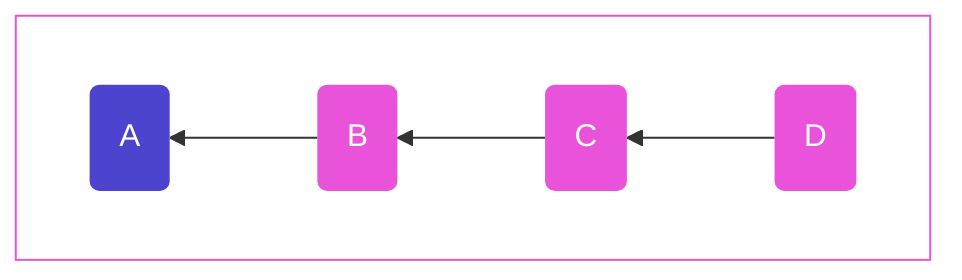
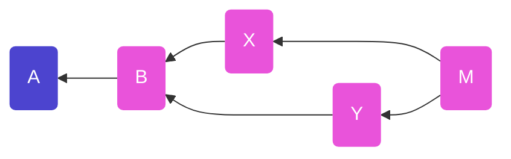
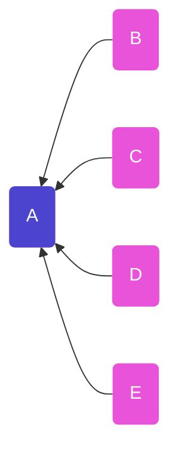
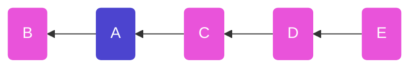
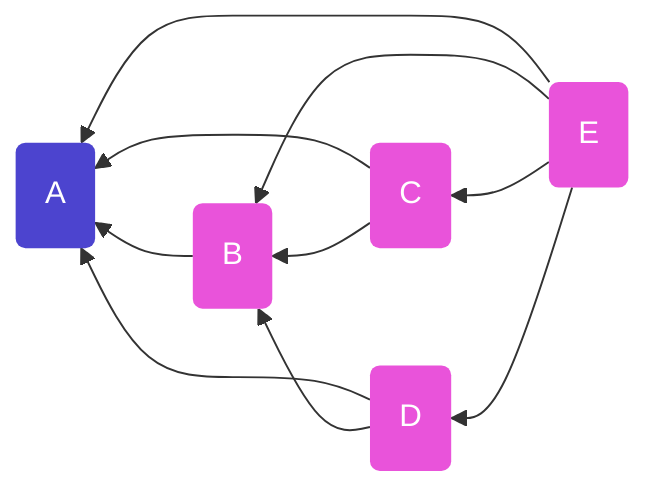
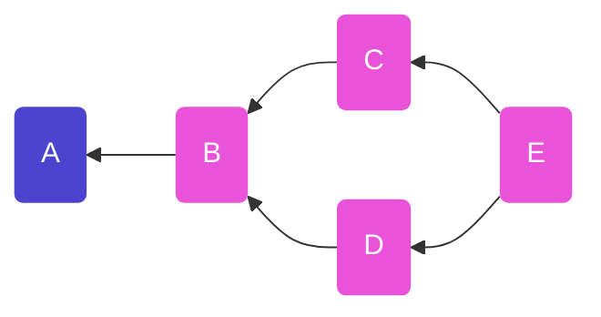
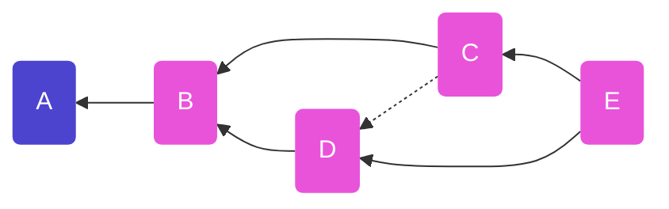

# Tangles

Authors: Mix Irving <mix@protozoa.nz>, Andre Staltz <contact@staltz.com>

Date: 2023-03-23

License: CC0-1.0


## Abstract

In any given set of SSB messages, it is impossible to determine their partial or
total order based on timestamps alone.  However, including the hashes of
previous messages in a message allows us to determine the order of messages.  In
this SIP, we specify a consistent way of declaring hashes of previous messages,
such that they form a directed acyclic graph (DAG).  This DAG is useful for many
use cases, including replication, and multi-writer "records".


## Motivation

As a permissionless, decentralized, and eventually consistent database, SSB
cannot rely on timestamps to determine the order of messages. Instead, when a
message refers to the hash of another message, we can infer that the message
that was referred to must have been created first, because we cannot create that
hash without knowing the original data. These referred hashes effectively form a
proof that a message was created after another message.

A "tangle" in SSB is a pattern of declaring previous message hashes, which will
define a directed acyclic graph (DAG) of messages.  A tangle is a useful way to
determine a partial ordering which in turn is useful for everything from
replication to building multi-writer "records".

A topological sort of a tangle renders a linear ordering of messages, which is
useful for displaying messages in user interfaces.


## Terminology

The key words "MUST", "MUST NOT", "REQUIRED", "SHALL", "SHALL NOT", "SHOULD",
"SHOULD NOT", "RECOMMENDED", "MAY", and "OPTIONAL" in this document are to be
interpreted as described in RFC 2119.


## Specification

There are different types of tangle, but they all MUST specify:

1. **Candidates messages**: the set of messages which _could_ be part of the
  tangle
2. **Recipe**: how the tangle (the DAG) is constructed from these candidates

It is RECOMMENDED for every recipe to start with some "root message" and extend
out from that point, checking the validity of messages as they are added.  Some
candidate messages may not have connections to the graph, or may be "invalid"
extentions, in which case they are excluded from the tangle.

A given message MAY belong to zero, one, or many tangles.  Each tangle
is a separate DAG.  A tangle is identified by a human-readable string.

TODO: glossary for "oldest" message (this will be the `root`)
TODO: glossary for "tip" messages


### Tangle fields in messages

Each message `m` in a tangle SHOULD have a `tangles` field in the `content`
field, i.e. `m.content.tangles`.  If `m.content.tangles` exists, its value MUST
be an object with one field for each tangle.  The key of the field MUST be the
tangle's human-readable identifier string (lets refer to it here as `x`), and
the value MUST be an object with the following fields:

- `root`: the ID of the root message of the tangle or `null` if `m` is the root
- `previous`: an Array of message IDs of the known tip(s) of the DAG at the time
  `m` was published, or `null` if `m` is the root


### Classic feed: single-author tangle

The most trivial tangle is the classic SSB feed.  In this case, the tangle for
feed `A` is defined as:

1. **Candidates messages**:
   - MUST have `author` field equal to `A`
2. **Recipe**:
   1. Find the message with `sequence` field equal to `1` as your "root"
       - Check it's signed correctly by `A`
   2. Find the message with `sequence` field equal to `i` for some `i` > `1`
       - Check it's signed correctly by `A`
       - Check its `previous` field points to a message with `sequence` field
         equal to `i-1`




The tangle data these messages carry looks like:
```javascript
a => { sequence: 1, previous: null, ... }
b => { sequence: 2, previous: a, ... }
c => { sequence: 3, previous: b, ... }
d => { sequence: 4, previous: c, ... }
```

(The fields `author`, `signature`, `timestamp`, `hash`, and `content` have been
ommited here to make the backlinking pattern clearer)

This is a special case of a tangle, for a few reasons:

- This tangle does not have `m.content.tangles[x]` with `root` and `previous`
- The DAG is a single chain, with no branches or merges


### Multi-author tangle

While the classic feed is a special case of a tangle without branches, in the
case of multiple authors, we need to support branches and merges. This is
because different authors may contribute concurrently, or while offline.


_Diagram where messages X, Y were both published concurrently (so were unaware
of one another). Message M is aware of both X and Y, and extends the tangle from
them.  M is now the new "tip" of the tangle._

The tangle data these messages carry looks like:

```javascript
A => { root: null, previous: null }
B => { root: A,    previous: [A] }
X => { root: A,    previous: [B] }
Y => { root: A,    previous: [B] }
M => { root: A,    previous: [X, Y] }
```

Where:
- `root` is the ID of the root message of the tangle
- `previous` is an Array of message IDs of the tip(s) of the tangle at the time
  this message was published

Note: the root message cannot include its own ID (not known until published),
so it sets its `root` value as `null`, which means "I am a root".


TODO: explain that this is a "tangle pattern" because there is no "candidates"
and "recipe" here and `m.content.tangles[x]` is not used.


## Origin Story

Tangles come from the observation that because message ids are derived from
hashes (over content, timestamp, signature), it is only possible to reference
messages that have been published _in the past_. Or you can only point
_backwards in time_ in scuttlebutt.

Here's the how you reach the idea of a tangle:

## 1. Identify the messages in the thread

We start by identifying which messages are related to a thread. A thread starts
with a "root" message `A`, and we look for all messages which have referenced
`A` as their "root" (i.e. check the `.tangles.root` field)


_Diagram showing the **backlinks** - references pointing back to a particular
message - from thread replies to the root message of the thread._

## 2. Order the messages

### a) by timestamp
The naive approach is to order by timestamp. We have two timestamps to work
with - the **received timestamp** (when we first got the message) or the 
**asserted timestamp** (when the author said they published it). We can't rely
on either because sometimes people's system clocks are wrong, or sometimes
people lie and assert a wrong timestamp.


_Diagram showing how ordering by timestamp can result in "incorrect" ordering._

This problem doesn't exist in centralised systems because there is (generally)
a globally consistent time - the clock of the server. This time can be "wrong",
but will still conserve relative ordering.

### b) by listing all previous messages

And improvement on this is if each message list all messages it was aware of
**previous** to it

So we might have something like:

msg | previous messages | notes
----|----------------|--
`A` | `[]`           | the root has no messages before it
`B` | `[A]`          |
`C` | `[A, B]`       |
`D` | `[A, B]`       | see that `D` did not know about `C` _(did not have msg yet)_
`E` | `[A, B, C, D]` |


_Diagram showing backlinks from each message to each previous message_

This is starting to reveal an order! We can be confident in this ordering
because each of these backlinks is pointing to a message key, which is a _hash_
of the message. These **cannot** be known ahead of time (because hashes are
sensitive to message content, which includes the asserted publishing time, and
this cannot be known), therefore we have a guarentee that each of these links
points **backwards in time**

BUT, you can already see this isn't going to be sustainable. As a thread gets
long, the previous messages that need to be mentioned keeps increasing. This
leads us to our final solution.

### c) by listing immediately previous messages

In the above table, we can see that there's a lot of redundancy. Check out this
alternative 

msg | immediately previous
----|----------------------
`A` | `[]`
`B` | `[A]`
`C` | `[B]`
`D` | `[B]`
`E` | `[C, D]`

If we look at any message we can derive **all** previous messages previous to
it by recurrsively following the trail of **immediately previous**, collecting
the messages mentioned as we go.

<details>
<summary>See code example (click)</summary>
In code, something like:

```js
function allPrevious (msg) {
  return (
    immediatelyPrev(msg) +
    immediatelyPrev(msg).map(prevMsg => allPrevious(prevMsg))  // recursion!
  )
}
```
</details>

So for a message like `C` that means:
```
allPrevious(C)
  = [B] + allPrevious(B)
  = [B] + ([A] + allPrevious(A))
  = [B] + [A] + []
  = [B, A]
```

Similarly with `E` we can follow collect previous links recursively (following
the immediately previous links `[C, D]`) to get `[C, D, B, A]`

```
All messages prior to E
  = [C, D] + allPrevious(C) + allPrevious(D)
  = ...
  = [C, D, B, A]
```

This is great because it shows that by listing ONLY the messages immediately
previous to the message being published, we can still figure out ALL the
messages which are previous to our message in the thread.

If we render these backlinks in a graph we can see a much less chaotic graph
emerging:



_Diagram of a tangle of messages showing backlinks only to messages that were
the current most recent nodes on the graph at time of publishing_


### d) by listing immediately previous messages + breaking ties!

The last solution for ordering is awesome, but it also leaves some ambiguity
about how to display the messages. (Personally, I would love to see a client
which shows messages in a graph like this, because sometimes it's very relevant
that the author of `D` did not know about `C`)

Most scuttlebutt clients flatten these graphs into a linear history. To do this
you need to identify when it's not clear about ordering, and provide a rule for
breakaing ties.
In our example above this means sorting `[C, D]`.

The most common tie breaking algorithm is something like:
> sort by min("asserted timestamp", "received timestamp")

<details>
<summary>See code example (click)</summary>
or in code:

```js
function sortMsgs (msgs) {
  return msgs.sort((A, B) => (
    Math.min(B.timestamp, B.value.timestamp) - 
    Math.min(A.timestamp, A.value.timestamp)
  ))
}
```
_We take the min of these two timestamps because we trust our own clock more
than a strangers? It limits their ability to lie about being in the future._
</details>



_Diagram the same as \(c\) but with a **solid line** showing the effect of
tie-breaking by timestamp._


## 3. Publishing a new message to a thread

Following the algorithm described in \(c\) / (d), if a new message `F` was to
be published (that had all the messages shown above), it would only need to list
the immediately previous message(s) i.e. `[E]`, because that _implicitly_ tells
us that it follows `[A, B, C, D, E]`. 


## Considerations

TODO

## References

TODO

### Normative

TODO (List SIPs and RFCs that this document depends on)

### Informative

TODO (List any other links here)

### Implementation

TODO (Put a link to your reference implementation)
