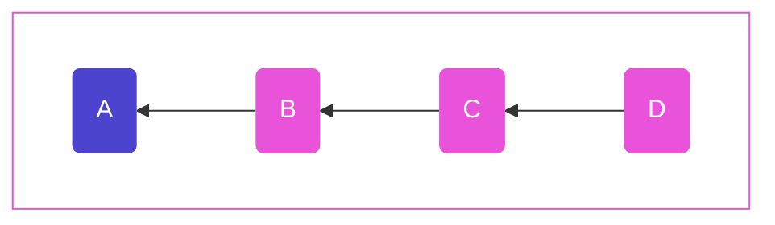
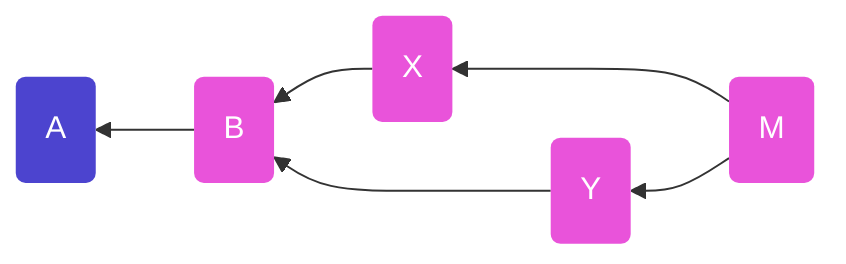

# Tangles

Authors: Mix Irving <mix@protozoa.nz>, Andre Staltz <contact@staltz.com>

Date: 2023-03-23

License: CC0-1.0


## Abstract

In any given set of SSB messages, it is impossible to determine their partial or
total order based on timestamps alone.  However, including the hashes of
previous messages in a message allows us to determine the order of messages.  In
this SIP, we specify a consistent way of declaring hashes of previous messages,
such that they form a directed acyclic graph (DAG).  This DAG is useful for many
use cases, including replication, and multi-writer "records".


## Motivation

As a permissionless, decentralized, and eventually consistent database, SSB
cannot rely on timestamps to determine the order of messages.  Instead, when a
message refers to the hash of another message, we can infer that the message
that was referred to must have been created first, because we cannot create that
hash without knowing the original data.  These referred hashes effectively form
a proof that a message was created after another message.

A "tangle" in SSB is a pattern of declaring previous message hashes, which will
define a directed acyclic graph (DAG) of messages.  A tangle is a useful way to
determine a partial ordering which in turn is useful for everything from
replication to building multi-writer "records".

A topological sort of a tangle renders a linear ordering of messages, which is
useful for displaying messages in user interfaces.


## Terminology

The key words "MUST", "MUST NOT", "REQUIRED", "SHALL", "SHALL NOT", "SHOULD",
"SHOULD NOT", "RECOMMENDED", "MAY", and "OPTIONAL" in this document are to be
interpreted as described in RFC 2119.


## Specification

There are different types of tangle, but they all MUST specify:

1. **Candidates messages**: the set of messages which _could_ be part of the
  tangle
2. **Recipe**: how the tangle (the DAG) is constructed from these candidates

It is RECOMMENDED for every recipe to start with some "root message" and extend
out from that point, checking the validity of messages as they are added.  Some
candidate messages may not have connections to the graph, or may be "invalid"
extensions, in which case they are excluded from the tangle.

A given message MAY belong to zero, one, or many tangles.  Each tangle
is a separate DAG.  A tangle is identified by a human-readable string.

We define:
- **the root message** as the earliest message in a tangle. Causally it is the
  "oldest", and is often used to identify all other candidate messages.
- **the tip(s)** of the tangle are the message(s) at the leading or "newest" end
  of the tangle i.e. it can transitively connected to the root, and no other
  messages yet link back to it.

There MUST only be one root message per tangle.


### Tangle fields in messages

Each message `m` in a tangle SHOULD have a `tangles` field in the `content`
field, i.e. `m.content.tangles`.  If `m.content.tangles` exists, its value MUST
be an object with one field for each tangle.  Each key of the field MUST be the
tangle's human-readable identifier string (lets refer to it here as `x`), and
the value MUST be an object (called the "tangle data") with the fields:

- `root`: the ID of the root message of the tangle or `null` if `m` is the root
- `previous`: an Array of message IDs of the known tip(s) of the DAG at the time
  `m` was published, or `null` if `m` is the root


### Classic feed: single-author tangle

The most trivial tangle is the classic SSB feed.  In this case, the tangle for
feed `A` is defined as:

1. **Candidates messages**:
   - MUST have `author` field equal to `A`
2. **Recipe**:
   1. If the candidate message has `sequence` field equal to `1`, then its field
    `previous` MUST be `null`
   2. If the candidate message has `sequence` field equal to `i` where `i` is a
    number greater than `1`, then its field `previous` MUST be the message ID of
    the message that has `sequence` field equal to `i - 1`




The tangle data these messages carry looks like:
```javascript
A => { sequence: 1, previous: null, ... }
B => { sequence: 2, previous: A, ... }
C => { sequence: 3, previous: B, ... }
D => { sequence: 4, previous: C, ... }
```

(The fields `author`, `signature`, `timestamp`, `hash`, and `content` have been
ommited here to make the backlinking pattern clearer)

This is a special case of a tangle, for a few reasons:

- This tangle does not have "tangle data" with `root` and `previous`
- The DAG is linear, with no branches or merges


### Multi-author tangle

While the classic feed is a special case of a tangle without branches, in the
case of multiple authors, we need to support branches and merges.  This is
because different authors may contribute concurrently, or while offline.

The following is not a description of a specific "tangle data" with candidates
and recipes, but rather a template for tangle data when there are messages from
multiple authors.

As a general pattern for multi-author tangle data: when a message is published,
its `previous` field SHOULD have the IDs of all known **tips** of the tangle,
and it SHOULD NOT have any other message IDs in its `previous` field.

As an example, suppose there are messages with tangle data that look like:

```javascript
A => { root: null, previous: null }
B => { root: A,    previous: [A] }
X => { root: A,    previous: [B] }
Y => { root: A,    previous: [B] }
M => { root: A,    previous: [X, Y] }
```

Then the directed acyclic graph (DAG) looks like:


_Diagram where messages X, Y were both published concurrently (so were unaware
of one another).  Message M is aware of both X and Y, and extends the tangle
from them.  M is now the new "tip" of the tangle._

Note that message `M` points to `X` and `Y` as its `previous` messages.  This
conforms to the general pattern for multi-author tangle data.

Further, the root message MUST NOT include its own ID (not known until
published), so it sets its `root` value as `null`, which means "I am the root".

The "tangle data" `{ root, previous }` for e.g. a "chess game tangle" SHOULD be
stored at `msg.value.content.tangles.chess`, note the choice of a human-friendly
name `chess` for the domain of a chess game.

Some tangles may have _candidates_ that define a strict subset of messages as
valid, e.g. only messages authored by peers the original author follows.


## Considerations

**Privacy Considerations** – if a tangle is encrypted (e.g. to a group) then all
messages in it should be encrypted similarly, because message backlinks reveal
the other authors who may have participated in the tangle, which may be a
privacy risk.  This means that you also want to be careful of revealing
individual messages in a tangle (a feature box1, box2 support).

**Implementation Considerations** – it's important that when defining a tangle,
the candidate messages and recipe are very clearly defined.  The recipe may also
need to include how a tangle should be presented to users (e.g. whether a tangle
is linearised, and how).

## References

### Informative

- [Tangle Origin](./009/tangle_origin.md) Story
- [tangle-js](https://gitlab.com/tangle-js) - a collection of NodeJS modules
  used for building tangles data, and reducing data held in messages.
  Effectively turns tangles into CRDTs

### Implementation

JavaScript:
- [`ssb-sort`](https://github.com/ssbc/ssb-sort) – used for tangle sorting used
by many JS clients.
- [`ssb-tribes/lib/get-group-tangle.js`](https://github.com/ssbc/ssb-tribes/blob/master/lib/get-group-tangle.js) – uses `@tangle` modules to determine tangle tips

