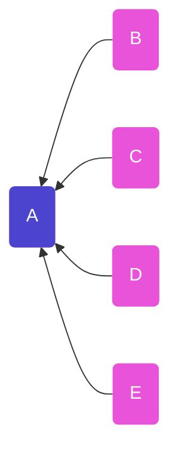
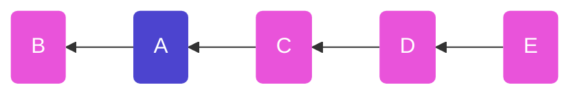
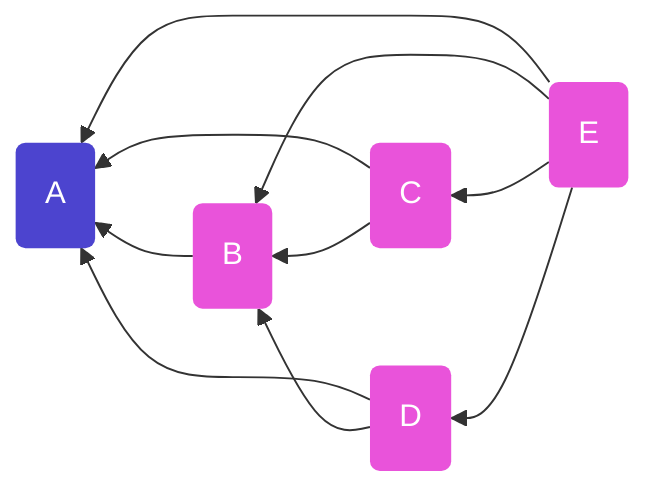
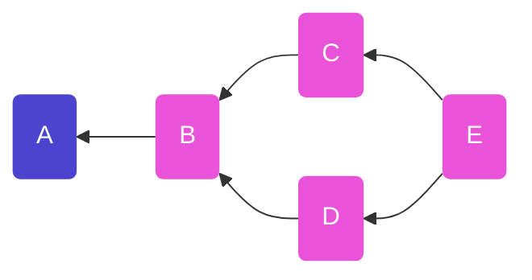
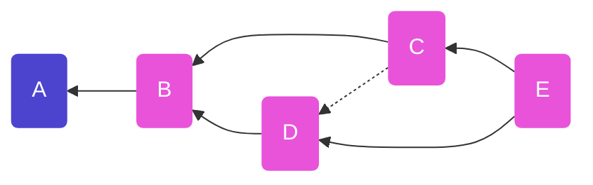

# Tangle Origin

The shape and pattern of tangles come from the observation that because message
ids are derived from hashes (over content, timestamp, signature), it is only
possible to reference messages that have been published _in the past_. Said
differently - you can only point _backwards in time_ in scuttlebutt.

Here's the how you reach the idea of a tangle:

## 1. Identify the messages in the thread

We start by identifying which messages are related to a thread. A thread starts
with a "root" message `A`, and we look for all messages which have referenced
`A` as their "root" (i.e. check the `.tangles.root` field)


_Diagram showing the **backlinks** - references pointing back to a particular
message - from thread replies to the root message of the thread._

## 2. Order the messages

### a) by timestamp
The naive approach is to order by timestamp. We have two timestamps to work
with - the **received timestamp** (when we first got the message) or the 
**asserted timestamp** (when the author said they published it). We can't rely
on either because sometimes people's system clocks are wrong, or sometimes
people lie and assert a wrong timestamp.


_Diagram showing how ordering by timestamp can result in "incorrect" ordering._

This problem doesn't exist in centralised systems because there is (generally)
a globally consistent time - the clock of the server. This time can be "wrong",
but will still conserve relative ordering.

### b) by listing all previous messages

And improvement on this is if each message list all messages it was aware of
**previous** to it

So we might have something like:

msg | previous messages | notes
----|----------------|--
`A` | `[]`           | the root has no messages before it
`B` | `[A]`          |
`C` | `[A, B]`       |
`D` | `[A, B]`       | see that `D` did not know about `C` _(did not have msg yet)_
`E` | `[A, B, C, D]` |


_Diagram showing backlinks from each message to each previous message_

This is starting to reveal an order! We can be confident in this ordering
because each of these backlinks is pointing to a message key, which is a _hash_
of the message. These **cannot** be known ahead of time (because hashes are
sensitive to message content, which includes the asserted publishing time, and
this cannot be known), therefore we have a guarentee that each of these links
points **backwards in time**

BUT, you can already see this isn't going to be sustainable. As a thread gets
long, the previous messages that need to be mentioned keeps increasing. This
leads us to our final solution.

### c) by listing immediately previous messages

In the above table, we can see that there's a lot of redundancy. Check out this
alternative 

msg | immediately previous
----|----------------------
`A` | `[]`
`B` | `[A]`
`C` | `[B]`
`D` | `[B]`
`E` | `[C, D]`

If we look at any message we can derive **all** previous messages previous to
it by recurrsively following the trail of **immediately previous**, collecting
the messages mentioned as we go.

<details>
<summary>See code example (click)</summary>
In code, something like:

```js
function allPrevious (msg) {
  return (
    immediatelyPrev(msg) +
    immediatelyPrev(msg).map(prevMsg => allPrevious(prevMsg))  // recursion!
  )
}
```
</details>

So for a message like `C` that means:
```
allPrevious(C)
  = [B] + allPrevious(B)
  = [B] + ([A] + allPrevious(A))
  = [B] + [A] + []
  = [B, A]
```

Similarly with `E` we can follow collect previous links recursively (following
the immediately previous links `[C, D]`) to get `[C, D, B, A]`

```
All messages prior to E
  = [C, D] + allPrevious(C) + allPrevious(D)
  = ...
  = [C, D, B, A]
```

This is great because it shows that by listing ONLY the messages immediately
previous to the message being published, we can still figure out ALL the
messages which are previous to our message in the thread.

If we render these backlinks in a graph we can see a much less chaotic graph
emerging:



_Diagram of a tangle of messages showing backlinks only to messages that were
the current most recent nodes on the graph at time of publishing_


### d) by listing immediately previous messages + breaking ties!

The last solution for ordering is awesome, but it also leaves some ambiguity
about how to display the messages. (Personally, I would love to see a client
which shows messages in a graph like this, because sometimes it's very relevant
that the author of `D` did not know about `C`)

Most scuttlebutt clients flatten these graphs into a linear history. To do this
you need to identify when it's not clear about ordering, and provide a rule for
breakaing ties.
In our example above this means sorting `[C, D]`.

The most common tie breaking algorithm is something like:
> sort by min("asserted timestamp", "received timestamp")

<details>
<summary>See code example (click)</summary>
or in code:

```js
function sortMsgs (msgs) {
  return msgs.sort((A, B) => (
    Math.min(B.timestamp, B.value.timestamp) - 
    Math.min(A.timestamp, A.value.timestamp)
  ))
}
```
_We take the min of these two timestamps because we trust our own clock more
than a strangers? It limits their ability to lie about being in the future._
</details>



_Diagram the same as \(c\) but with a **solid line** showing the effect of
tie-breaking by timestamp._


## 3. Publishing a new message to a thread

Following the algorithm described in \(c\) / (d), if a new message `F` was to
be published (that had all the messages shown above), it would only need to list
the immediately previous message(s) i.e. `[E]`, because that _implicitly_ tells
us that it follows `[A, B, C, D, E]`. 

