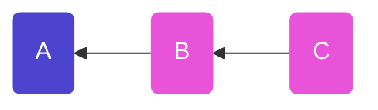
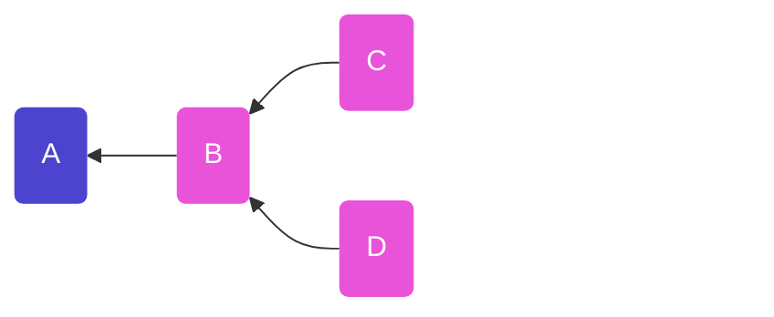
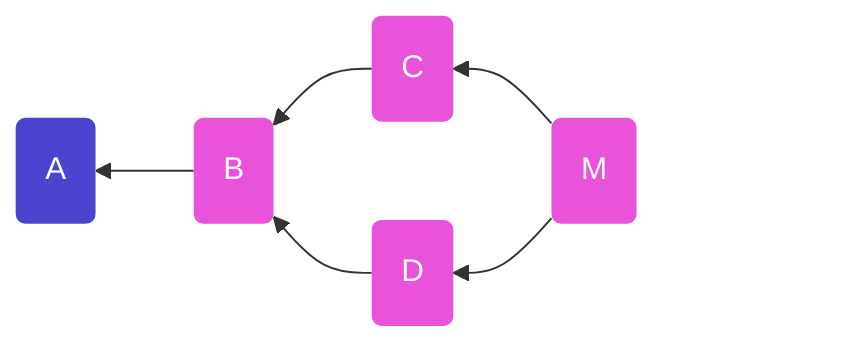
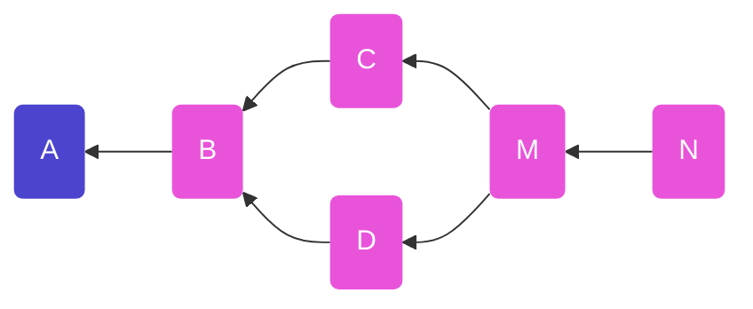
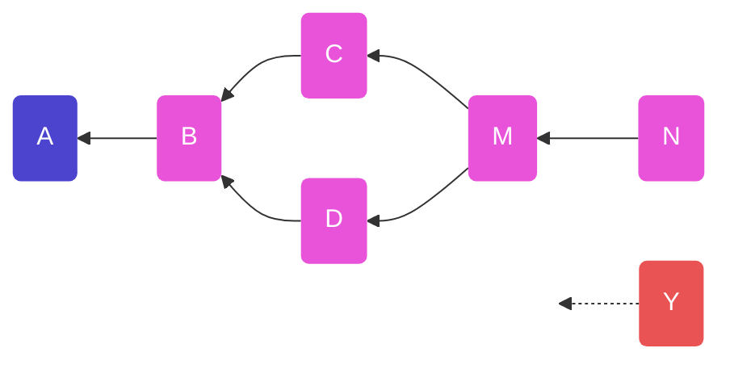
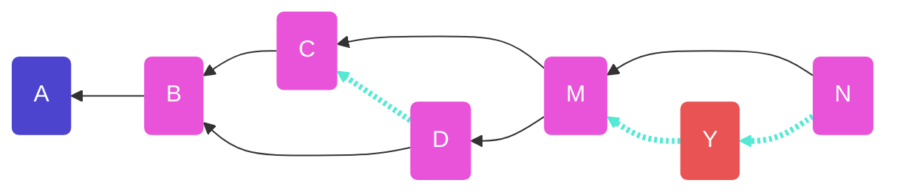
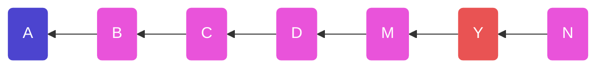

# Threads

Authors: Mix Irving mix@protozoa.nz

Date: 2023-03-27

License: CC0-1.0

The `post` message type is the foundational unit for talking with peers on
the original scuttlebutt network. 

`post` messages can be used standalone, but are most commonly collected as
sets of related messages and formed into a "thread".

During rendering, threads of posts are also further _decorated_ with `vote`
messages (for likes), and `about` messages (for displaying author details).

## Terminology

The key words "MUST", "MUST NOT", "REQUIRED", "SHALL", "SHALL NOT", "SHOULD", "SHOULD NOT", "RECOMMENDED", "MAY", and "OPTIONAL" in this document are to be interpreted as described in [RFC 2119](https://tools.ietf.org/html/rfc2119).

## Specification
## 1. `post` schema

The following schemas relate to the `content` field in SSB messages. If a field is commented with `// optional`, it means it MAY appear in the `content` field, otherwise it SHOULD appear.

### 1.1. Root message

A "root message" is the first message that starts a particular thread

```javascript
{
  type: 'post',
  text: String,
  channel: String,       // optional
  contentWarning: String // optional
  mentions: [Mention],   // optional
  recps: [Recp]          // optional
}
```

### 1.2. Response message

These messages are used to post responses into a thread. They are NOT
used to reply to specific messages, rather to the currently held context
of a thread (see Tangles below).

```javascript
{
  type: 'post',
  text: String,
  root: MsgId,
  branch: [MsgId],
  channel: Channel,      // optional
  contentWarning: String // optional
  mentions: [Mention],   // optional
  recps: [Recp]          // optional
}
```

NOTE: sometimes `branch` will be a `MsgId` instead of `[MsgId]`
### 1.2. Channel

`Channel` should be the a `String` which:
- SHOULD NOT contain
    - hash symbol `#`
    - punctuation `,."!?`
    - brackets `()[]`
    - spaces ` `, 
- SHOULD NOT be longer than 30 characters long

When parsing a channel, you MUST normalize the channel name by:
1. removing disallowed characters
2. truncating to 30 characters (if required)
3. lowering the case of all characters
    - i.e. `NewZealand` is to be treated the same as `newzealand`, `newZealand` etc.

See [ssb-ref](https://github.com/ssbc/ssb-ref/blob/main/index.js#L95-L104) for a reference implementation of `normalizeChannel`

### 1.3. Mention

May take one of the following forms:

```javascript 
{
  link: FeedId,
  name: String  // optional
}
```
```javascript 
{
  link: MsgId
}
```
```javascript 
{
  link: BlobId,
  size: Int,    // optional
  name: String  // optional
}
```

You will also find `Mention` in the wild which are just a plain string
```
FeedId | MsgId | BlobId
```

## 2. `vote` Schema

`vote` messages are used for responding to `post` messages. Sometimes they are
called "likes" but they are used for expressing a range of emotional responses.

```javascript
{
  type: "vote",
  vote: {
    link: MsgId
    expression: String,
    value: 1
  },
  root: MsgId,         // optional
  branch: [MsgId]      // opptional
}
```

where:
- `link` is id of a `post` message you are posting an emotional response to
- `expression` is a string describing the emotional response
    - if this string can be mapped into an emoji e.g. `heart` => :heart: then
      then that is displayed
    - otherwise it's the interpretation falls back to "like" / :+1: 
- `value` is the weight of your `expression`
    - `0` means "make my response nothing again please"

Some clients also add thread tangle data to `vote` messages with the `root` and
`branch` fields. The rationale of this is that with more frequent messages
contributing to the tangle, forks are less likely - i.e. the tangle trends
towards being more linear.

## 3. Thread

A "thread" is a collection of `post` (and sometimes `vote`) messages that
are responses to a growing context. For the thread to make sense we need:
  - to gather all messages related to the thread
  - to know how to _order_ the messages

Because we don't have a centralised server, we don't have a guarenteed
"clock" to which we can use to determine a canonical `createdAt` time for
each message. Our solution is to use build a Directed Acyclic Graph (DAG)
out of the messages, by backlinking to messages earlier in history.

### 3.1. Thread tangle


We define:
- **thread tangle** - a Directed Acyclic Graph of messages
- **root message** - the first message of a particular thread tangle
  particular rules
- **tangle tip(s)** - the messages in our tangle which have no messages
  linking to them


_Figure 1. A thread of `post` causally ordered with backlinks. The "root" of
this thread tangle is message `A`. The "tip" of this tangle is message `C`._

To build this tangle, we add two new fields to any `post` messages following
the root message:
- `root`: set to the id of the root message of the thread
- `branch`: set to the id of the latest message(s) in the thread
    - NOTE: this field is used for causal ordering, NOT for indicating what you are replying to (though these concepts may converge at times)

For each of the messages in _Fig. 1_ the root and branch are as follows:  
```javascript
A => {} 
B => { root: A, previous: [A] }
C => { root: A, prevoius: [B] }
```

<details>
<summary>See full content of A,B,C (click) </summary>
Examples of what the content of messages in _Fig 1._ would look like
  
```javascript
// A
{
  type: 'post',
  text: 'Lets have a shared dinner!'
}
```
```javascript
// B
{
  type: 'post',
  text: 'Love it, shall we make pizza?',
  root: A,
  branch: [A]
}
```
```javascript
// C
{
  type: 'post',
  text: 'I will bring pineapple!',
  root: A,
  branch: [B]
}
```
</details>
<br />


Because new messages may be posted concurrently in scuttlebutt, it's possible
for threads to become "forked". We also say the graph now has "multiple tips".



When you are publishing a new message to the thread, and notice there are
multiple tips, then those tips become your `previous`





```javascript
D => { root: A, previous: [B] }
M => { root: A, previous: [C, D] }
N => { root: A, previous: [N] }
```

<details>
  <summary>See full content of D, M, N (click)</summary>
```javascript
// D
{
  type: 'post',
  text: 'yes, so long as we avoid pineapple (I am alergic)',
  root: A,
  branch: [B]
}
```

```javascript
// M
{
  type: 'post',
  text: 'Oh all good, I can leave the pineapple.'
  root: A,
  branch: [C, D]
}
```
</details>
<br />

### 3.2. Disconnected messages

We define a **disconnected message** as a message which asserts it is part
of a thread, but does not have a continuous link back to the root message of
our thread



Here message `Y` says it's part of the thread, but it backlinks to some message
that we do no have
```javascript
y => { root: A, branch: [X] }
```

This message is not well connected, but it's common to render it in later steps
regardless


## 4. Thread Forks

TODO

## 5. Rendering a thread


Each message is generally displayed showing:
- author name + image (derived from `msg.value.author` and other messages outside
  the scope of this spec)
- `timestamp`
- `text` rendered as markdown
- sometimes further data such as
  - a summary of `vote` responses
  - info about any `fork` that this `post` started
  - a list of other threads which have linked to this message (backlinks)

### 5.1. Linear rendering of a tangle

A tangle with forks is hard to render as a nice linear output (the most familiar
way humans like to engage with threads in).

We build a tangle, to get partial ordering, then for **concurrent messages**, we
break ties using the "timestamp" that the message was published at.
(timestamp here is the minimum of the asserted timestamp (`msg.value.timestamp)`
and the timestamp the message was received at (`msg.timestamp` in the JS
implementation)



_Figure. showing the creation of a tangle, then tie-breaking between concurrent
messages `C`,`D`, and best-guess insertion of disconnected message `Y`_

For **disconnected messages** we try to place them in the correct position by
timestamp alone. It could be a good idea to indicate in UI that this message may
be in the wrong place and is missing context.



_Figure. showing a linearised thread tangle, along with a "best guess" placement
of disconnected message `Y`._


### 5.2. Scuttlebutt Markdown

The `text` field of `post` messages is Scuttlebutt flavoured Markdown, which is
basic Markdown with a couple of important privacy enhancing features.

#### 5.2.1 Image rendering

DO NOT render images that link to the web. This leaks data, which allows
tracking of users.
```markdown

```
Such images MUST instead be rendered as a link with an alert/ warning
(see 6.2.2).

ONLY render images that link to blobs that are hosted locally:
```markdown

```

#### 5.2.2 Link rendering

When a link to the web is present, the interface MUST render an alert to users
on-click. Similar to 6.2.1, this is to prevent accidental tracking.

```markdown
[click here](www.google.com)
```

#### 5.2.3 Old @mentions (deprecated)

Older messages used `mentions` in a fancy way so that the text didn't have
honking ugly markdown links to feedIds in it, but most clients have given
this up

```javascript!
{
  type: 'post'
  text: 'This was an innovation @pfraze came up with',
  mentions: [
    {
      link: '@hxGxqPrplLjRG2vtjQL87abX4QKqeLgCwQpS730nNwE=.ed25519',
      name: '@pfraze'
    }
  ]
}
```
The mentions are then used to map the `text` to this before rendering:
```markdown
This was an innovation [@pfraze](@hxGxqPrplLjRG2vtjQL87abX4QKqeLgCwQpS730nNwE=.ed25519)
came up with',
```

### 5.3. Blocked authors

If some message `B` is from a blocked author, we may still use its tangle data
for causal ordering, but not render that message in the thread. 
  
The message MUST NOT be displayed to by deault in the UI, but it is up to the
particular client whether this means
- not rendering it at all
- rendering an empty skeleton message saying "message from blocked author"
- rendering a skeleton saying "message from blocked author, do you want to
  display?"
  

### 5.4. Content warnings

If the post contains a `contentWarning` field, the UI SHOULD NOT display the
raw content and instead display a message which:
1. alerts that this message has a content warning
2. displays the String in `contentWarning`

If the user clicks "show content" (or similar) then the message should be
rendered as usual.

## Reference implementation

- [ssb-threads](https://github.com/ssbc/ssb-threads)
## Informative references

- this spec first started in thread:
   - `ssb:/message/classic/dm4NuPPxA_Jyxpu2yFj7SzAeF1u4G_75D-bzJGDt504=`
   - (or `%dm4NuPPxA/Jyxpu2yFj7SzAeF1u4G/75D+bzJGDt504=.sha256`)
